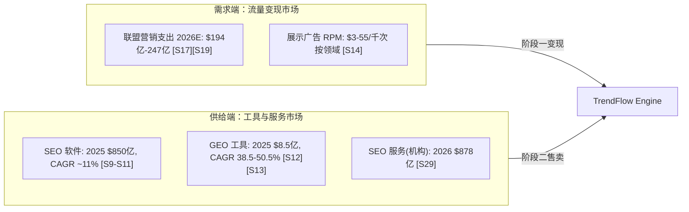
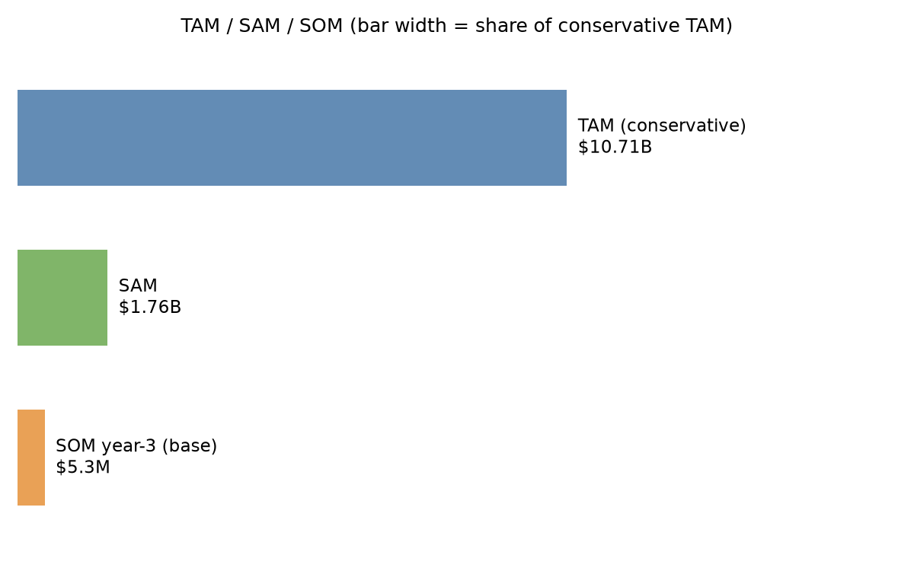

# 第二章 市场分析

本章数字全部继承自《商业机会挖掘与分析报告》第二章（来源交叉与口径讨论见彼处），此处按商业计划视角重组。

## 2.1 市场分层

本项目两阶段分别站在两个市场：阶段一是需求端的**参与者**（自营流量变现），阶段二是供给端的**卖水人**（SaaS 工具）。

## 2.2 TAM / SAM / SOM

计算：`scripts/03_market_sizing.py`（参数逐项标注来源/假设编号，敏感性分析内置）。

| 层 | 值 | 计算逻辑 |
|---|---|---|
| TAM | **$107.1 亿**（2025，保守口径；2028 年 $154.1 亿） | 取双口径较小者：自上而下（SEO 软件 $850 亿 × 12% 可服务份额 H1 + GEO $8.5 亿 × 60% SaaS 份额）vs 自下而上（$869.6 亿） |
| SAM | **$17.6 亿** | TAM × 47% 英文市场 [S19] × 35% 定位适配子群（H5） |
| SOM（3 年） | 保守 $180 万 / **基准 $530 万** / 乐观 $1,410 万 | SAM × 0.1% / 0.3% / 0.8% 市占 |

稳健性：假设 H1 取 8%–20% 区间时 TAM 为 $73 亿–175 亿，"十亿美元级可服务市场"结论全区间成立。SOM 乐观值对标 Peec AI（10 个月 $400 万 ARR [S24]）属"激进但有先例"。

## 2.3 客户细分与进入顺序

| 优先级 | 细分 | 定价档 | 进入理由 |
|---|---|---|---|
| P0（阶段二首发） | 职业站长/联盟营销者（prosumer） | $49–149/月 | 决策链短、痛点最尖锐（流量即收入）、与自营样板间画像相同，转化叙事零翻译成本 |
| P1（月 18+） | 中小营销机构 | $399/月（多工作区） | 一客多站、ARPU 高；机构渴求 AI 交付工具维持毛利 [S29] |
| P2（月 24+） | SMB 直客 | $49–99/月 | 量大但教育成本高，待产品自助化成熟后以内容获客规模化进入 |

## 2.4 客户痛点的一手证据（深化：竞品公开评价归纳）

P0 客群的痛点不再是推理，竞品用户的公开抱怨提供了直接证据 [S45][S46]：

| 抱怨主题（高频原话） | 证据 | 对本产品的验证意义 |
|---|---|---|
| "输出太 generic / cookie-cutter，要大量人工编辑" | Jasper 在 G2（1,270 条评价）与 Reddit 的第一大负面主题 [S45] | 验证"事实密度+溯源+GEO 工艺"的质量定位；也警示：AI 成稿工具的天花板是编辑成本，我们的编辑效率工具是卖点而非成本项 |
| "为什么不直接用 $20 的 ChatGPT"（42% 用户提及价格） | Jasper $49–69/席 vs ChatGPT $20 的价值质疑 [S45] | 单纯"AI 写作界面"无定价权；定价权来自闭环（选题→发布→效果），这恰是裸 LLM 做不了的 |
| "SEO 要另买 Surfer（≈$75/月），工具栈越叠越贵" | Jasper+Surfer+热词工具的叠加订阅结构 [S45][S46] | 一体化闭环工作流替代 $160+/月的三件套，$49–149 定价具备替代经济性 |
| "Surfer 的相关性打分鼓励堆词" | 方法论批评 [S46] | 引用因子规格（第三章 3.4）以外部实证研究为准绳，非自造相关性分数 |
| 计费/退订纠纷频发 | Jasper Trustpilot/Capterra 负面集中区 [S45] | 透明计费、随时可退是低成本的信任差异化（与诚实守信原则一致） |

**结论**：市场缺的不是"另一个 AI 写作工具"，而是"从热词到已发布已验证的闭环 + 值得信任的质量与计费"——痛点证据与我们的产品定义逐条对应。

## 2.5 市场时机与窗口

- **顺风**：GEO 赛道资本一年 $3 亿+ [S24] 教育了市场；Google 政策清场出清低质玩家 [S7]；LLM 成本降至单篇 $0.01 量级 [S26]。
- **逆风（如实呈现）**：AIO 覆盖率上升持续压缩信息类点击 [S4]；巨头套件（Semrush One、Ahrefs Brand Radar [S22][S23]）正在向 GEO 延伸。
- **判断**：执行层工作流的空位窗口估计 18–36 个月（推测）。本计划的阶段节奏（12 个月验证、13 个月起售卖）压在窗口内侧，无观望余地——这也是为什么阶段一必须同步研发产品化能力，而非串行。
