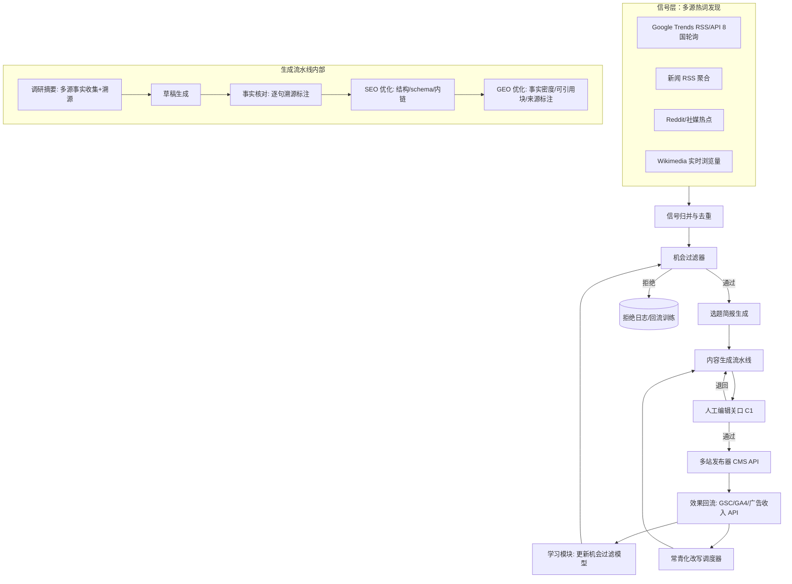

# 第三章 产品与技术架构

## 3.1 产品定义

**TrendFlow Engine**：从热词信号到"已发布、已双轨优化、经编辑关口"成稿的分钟级自动化流水线。阶段一为内部引擎（驱动自营站组合），阶段二加上多租户外壳成为 SaaS。

## 3.2 系统架构

## 3.3 核心模块设计要点

**机会过滤器（利润阀门，核心 IP）**
对每个热词信号打分：预估搜索量 × 意图类型（交易/对比类优先——AIO 出现率与引用红利见 [S1][S2]）× 变现潜力（领域 RPM 表 [S14]）× 竞争度（现有 SERP 强度）× 窗口预测（生命周期模型，用本项目 lifecycle 方法论持续更新）× **合规黑名单**（YMYL 高危、公序良俗排除项，一票否决）。阈值以下不生产——盲目全量追热会拉低组合 RPM（机会报告 3.3）。

**内容生成流水线（质量与成本的平衡）**
多轮结构：调研摘要（多源事实收集，逐条记 URL）→ 草稿 → 事实核对（逐句与来源比对，不可溯源句子删除或标注）→ SEO 面（标题/结构/schema.org/内链）→ GEO 面（按 3.4 节工艺规格生成可引用结构）。经济层 LLM 即可胜任（单篇 $0.012 [S26]），模型可路由替换，无单一供应商依赖。

**人工编辑关口（合规护栏 C1，不可绕过）**
每篇 15 分钟人工审核：事实抽查、价值判断（"这篇对读者有真实增量吗"）、品牌语调。审核记录入审计日志。单篇编辑成本 $7.50，占成稿成本 94%——**我们把成本花在政策要求的地方**。编辑效率工具（差异高亮、来源一键核对）持续摊薄该成本。

**效果回流学习（数据飞轮）**
发布后 Search Console/GA4/广告收入数据按篇回流，形成"热词特征 × 内容类型 × 优化策略 → 流量/收入"私有数据集，持续再训练机会过滤器。**这个数据集是随时间加深的护城河，竞品（监测型工具）没有生产环节，无法积累。**

## 3.4 GEO 引用工艺规格（深化：产品核心竞争力的证据基础）

"被 AI 引用"不是玄学，2026 年已有可复现的量化研究。对 1,000 个 AI Overview、30 个垂直领域的抽样研究 [S31] 与多来源交叉 [S32][S33][S34] 给出了效应量，我们据此把工艺写成流水线的确定性规则：

| 引用因子（按效应量排序） | 实证效应 | 流水线实现（自动化程度） |
|---|---|---|
| 语义完整度（主题覆盖深度） | 与引用 r=0.87；8.5+/10 分页面被引用 4.2 倍 [S31] | 选题简报自动生成子问题簇（fan-out 覆盖），草稿必须逐一回答（全自动+编辑抽查） |
| Schema 结构化标记 | 引用率 2.3 倍 [S31]；被称为"最便宜的 2.3 倍杠杆" [S32] | FAQPage/HowTo/Article/Product schema 按页面类型自动注入，且与可见正文严格一致（全自动） |
| 正文内具名来源 | +2.1 倍 [S32]；96% 引用来自可验证权威来源 [S34] | 事实核对环节强制逐句溯源+外链具名（全自动+编辑复核） |
| 句子级可提取性 | 引用单位是句子而非页面：自足、具体、含数字的句子被整句提取 [S32] | 生成提示词强制"每个 H2/H3 首句 40–60 词直接作答"；模板禁用铺垫式开头 [S33]（全自动） |
| 多模态（图/表/视频） | 入选率 +156% [S31] | 数据表格自动生成；配图自动化；视频为后期选配（部分自动） |
| 长文+E-E-A-T | 2,500 词+ 引用率 +1.6 倍 [S32]；强 E-E-A-T 的第 6–10 名被引用率超弱 E-E-A-T 的第 1 名 [S31] | 作者页/资质署名/更新日期标准化组件；2025-12 核心更新后 E-E-A-T 适用于全部类目 [S34]（全自动模板） |

**约束（如实呈现）**：YMYL 领域须自然排名前 10 才有引用资格 [S32]——这与我们的 YMYL 黑名单策略互相印证：新站在 YMYL 领域连入场券都没有，回避是唯一理性选择。

该规格的商业含义：竞品（Jasper/Surfer 等）的输出被用户批评为"generic、需大量编辑、无 SEO 纵深" [S45][S46]，而上表六项没有一项完整存在于其产品中——**工艺规格本身即差异化**，且我们的效果回流数据将持续校准各因子权重（竞品没有生产-效果闭环，无法迭代）。

## 3.5 技术栈与研发计划

| 组件 | 选型 | 理由 |
|---|---|---|
| 流水线编排 | Python + 任务队列（Celery/Temporal） | 生态成熟，重试/审计友好 |
| LLM | 经济层多模型路由（Gemini Flash 级/GPT Nano 级/DeepSeek [S26]）+ 中间层复核 | 成本/质量分层，供应商冗余 |
| 发布端 | WordPress/Headless CMS API | 站群标准化，SaaS 阶段客户侧兼容面广 |
| 数据 | Postgres + 对象存储（审计日志、快照） | 常规 |
| SaaS 外壳（阶段二） | 多租户 Web 应用 + 计费（Stripe） | 常规 |

研发里程碑：M1–M3 流水线 MVP（单站跑通）；M4–M6 机会过滤器 v1 + 多站发布；M7–M12 效果回流学习 + 编辑效率工具 + 产品化预研；M13+ SaaS 多租户、计费、自助上手（前提：过阶段门槛）。

## 3.6 产品级合规护栏（C1–C5 的产品实现）

- 速率上限：单站单日发布量硬上限（防止客户用产品造垃圾站）；
- 编辑关口强制：未经人工确认不可发布（API 层强制，不可配置绕过）；
- 质量分门槛：低于阈值的草稿不进入发布队列；
- 选题黑名单：YMYL 高危与公序良俗排除项全局生效；
- 透明披露：产品文档如实说明平台风险与能力边界，不承诺"保证排名"；
- 法务自动化（第十一章的产品实现）：联盟链接就近自动插入 FTC 披露语 [S41]、隐私政策/Cookie 同意组件默认启用 [S44]。
