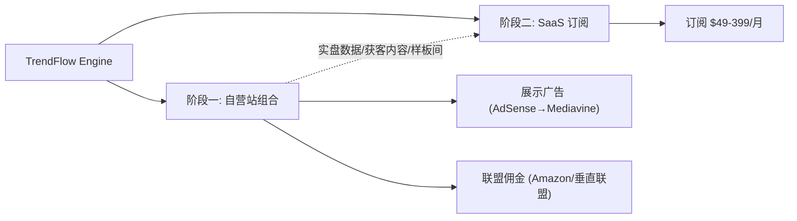
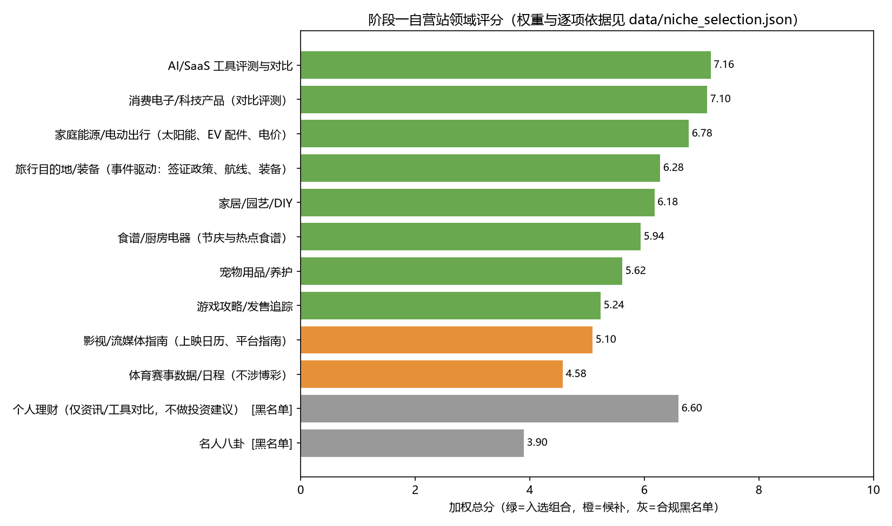

# 第四章 商业模式与单位经济

## 4.1 收入结构（两阶段）

**阶段一：自营变现**
- 展示广告：新站从 AdSense（$3–12 RPM）起步，达到 5 万会话/月后升级 Mediavine（$15–40 RPM）[S14][S15]——广告网络升级本身就是内置的收入跳档机制；
- 联盟佣金：交易/对比类内容挂联盟链接，行业平均佣金 8.3% [S18]，AI 渠道流量转化率 14%（传统 2.8%）[S17]；
- 领域组合（深化：`scripts/08_niche_selection.py` 量化评分，12 个候选领域 × 6 项加权准则，逐项标注依据）：基准 8 站按评分序为 **AI/SaaS 工具评测（7.16）、消费电子对比（7.10）、家庭能源/电动出行（6.78）、旅行装备（6.28）、家居园艺（6.18）、食谱厨电（5.94）、宠物（5.62）、游戏攻略（5.24）**——跨 8 个独立领域分散算法风险；个人理财与名人八卦虽然分别有最高 RPM 与最高热词供给，但被合规黑名单一票否决（YMYL 高危/公序良俗风险）。组合均权 RPM 约 $14.2/千次，与财务模型基准 RPM=15 假设量级一致（详见 `data/niche_selection.json`）。

**阶段二：SaaS 订阅（月 13 起，须过阶段门槛）**

| 档位 | 定价 | 内容 | 对标锚点 |
|---|---|---|---|
| Starter | $49/月 | 1 站、每日热词简报、20 篇/月成稿额度 | Surfer $49 [S25]、Otterly $29 [S24] |
| Pro | $149/月 | 3 站、全自动流水线、GEO 优化、100 篇/月 | Exploding Topics $99–249 [S20] |
| Agency | $399/月 | 10 工作区、白标报告、API | Profound Growth $399 [S24] |

混合 ARPU 假设 $99/月（H13），定价处于竞品带宽中位，凭"执行闭环"（竞品只监测/只研究）与实盘背书取胜而非低价。

## 4.2 单位经济（`scripts/05_unit_economics.py` 可复现）

**内容单位：单篇成稿 $8.01**

| 成本项 | 金额 | 说明 |
|---|---|---|
| LLM（经济层多轮流水线） | $0.012 | 60K 输入 + 15K 输出 token [S26] |
| 人工编辑关口 | $7.50 | 15 分钟 × $30/时（合规护栏 C1） |
| 图片/结构化数据等 | $0.50 | |

即使 LLM 用中间层模型（Claude Sonnet 级）单篇也仅 $8.41——**LLM 价格对单位经济不敏感，编辑效率才敏感**。编辑工具每提效 20%，单篇成本降 $1.50。

**站点单位：单站月投入约 $541（60 篇 × $8.01 + $60 托管）**

| 情景 | 成熟期单篇月 PV | RPM | 月度盈亏平衡 | 累计回本 | 月 36 单月利润 |
|---|---|---|---|---|---|
| 保守 | 40 | $8 | 第 29 月 | 未回本 | $150 |
| 基准 | 120 | $15 | 第 11 月 | **第 17 月** | $3,347 |
| 乐观 | 300 | $25 | 第 6 月 | 第 9 月 | $15,659 |

**SaaS 客户单位**

| 指标 | 值 | 依据 |
|---|---|---|
| ARPU | $99/月 | H13，对标 [S20][S24][S25] |
| 毛利率 | 78% | H14（LLM 推理+基础设施成本后） |
| 月流失率 | 4.5% → 平均生命周期 22.2 月 | H15，SMB SaaS 常见带宽 |
| CAC | $350 | H16（内容驱动为主：自营站群即获客渠道） |
| **LTV** | **$1,716** | $99 × 78% × 22.2 |
| **LTV : CAC** | **4.9** | 健康线为 3 |
| CAC 回收期 | 4.5 个月 | |

## 4.3 成本结构与经营杠杆

- 阶段一主要成本：人员（研发+编辑池，月 $32K 基准）> 内容生产与托管（8 站满产月 $4.3K）> 基础设施（$2.5K）；
- 阶段二新增：获客（新客数 × $350）与客成团队；
- 杠杆点：引擎边际成本近零——每个新 SaaS 客户复用同一条流水线；效果数据集随客户量增长反而提升过滤器质量（数据网络效应）。

## 4.4 模式的诚实弱点

1. 阶段一收入爬坡慢（基准年 1 仅 $7.5K），前 12 个月几乎纯投入——种子资金因此按三情景现金低谷 + 安全垫设计（第 8 章）；
2. ARPU $99 的假设依赖 prosumer 与机构分层成功，若客户集中在 Starter 档，ARPU 降至 ~$60，月 36 ARR 相应打 6 折（敏感性详见第 8 章）；
3. 流失率 4.5% 是行业常见值而非我们的实测值，阶段二前 6 个月的留存数据是该假设的第一次真实检验。
