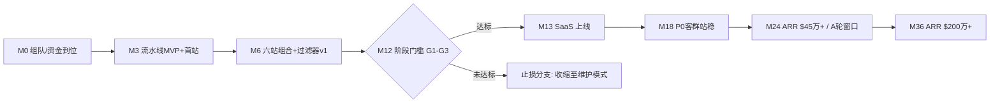

# 第九章 路线图与里程碑（阶段目标 + 客观可检验标准）

依据总纲第十八条：先定可分解的阶段目标，再用客观、可检验的标准衡量结果；目标未达时先查原因、再调方案。每个里程碑给出**验收标准（可由第三方核验的数字）**与**未达预案**。

## 9.1 总览

## 9.2 里程碑明细

| 里程碑 | 时点 | 验收标准（客观可检验） | 未达预案 |
|---|---|---|---|
| M3：流水线 MVP | 月 3 | 首站上线并连续 4 周稳定产出（≥60 篇/月）；热词→发布 P50 时延 <24 小时；编辑退回率 <35% | 时延/退回率超标：暂停扩站，先修流水线（工程规律：先试点后扩大） |
| M6：组合成型 | 月 6 | 4–6 站覆盖 ≥4 个独立领域；机会过滤器 v1 上线（拒绝率与理由留档）；组合月 PV ≥7,000 且连续 2 月环比 >30%（阈值=基准轨迹月 6 实绩 11,153 的约 60%，与 M12 门槛同一折算逻辑） | PV 未达但增速健康：继续；增速也未达：冻结开站，逐站诊断 |
| **M12：阶段门槛** | 月 12 | **G1 组合月 PV ≥100,000；G2 组合月收入 ≥$1,500；G3 近 3 月 PV 环比 ≥25%**（阈值=基准轨迹月 12 实绩 170K PV/$2,554 的约 60%） | **未达即执行止损分支**：停产收缩至维护模式，保留存量现金流与技术资产（保守情景演示：期末现金 $113 万）；GTM 预算不解锁 |
| M13：SaaS 上线 | 月 13 | 首月付费客户 ≥15（模型假设 20）；激活率（首周发布 ≥1 篇）≥60% | 客户 <10：回炉 waitlist/定价，延后 1–2 月，用运营储备金 |
| M18：P0 站稳 | 月 18 | 付费客户 ≥130（基准轨迹 147）；月流失 ≤6%；ARR ≥$15 万 | 流失 >6%：冻结获客投放，全力修激活与留存（先治本再放量） |
| M24：A 轮窗口 | 月 24 | ARR ≥$45 万（基准轨迹 $47.8 万）；LTV:CAC ≥3；机构档客户 ≥15 家 | ARR $30–45 万：不融资，放缓招聘走自足路线；<$30 万：战略复盘（含出售/合并选项，见第十章） |
| M36：规模验证 | 月 36 | ARR ≥$200 万（基准轨迹 $214 万）；人均 ARR ≥$25 万；现金流为正（基准轨迹月 34 转正） | 按差距幅度在"继续独立增长/被并购/利润化经营"三选项间决策 |

## 9.3 决策纪律

- 每个里程碑评估会输出书面结论：达标证据（数据链接）、未达原因分析（区分执行问题 vs 假设错误）、方案调整；
- **假设错误与执行问题分开处理**：执行问题修执行（换打法），假设错误改模型（重跑 `scripts/` 全链并更新计划）——不许用"再给一个月"模糊两者；
- 所有指标以原始系统数据为准（Search Console、GA4、Stripe、广告网络后台），禁止人工汇总口径。
