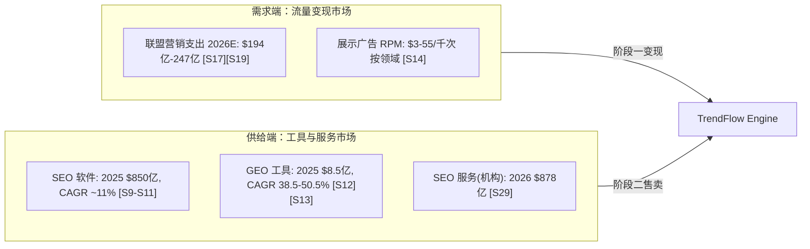
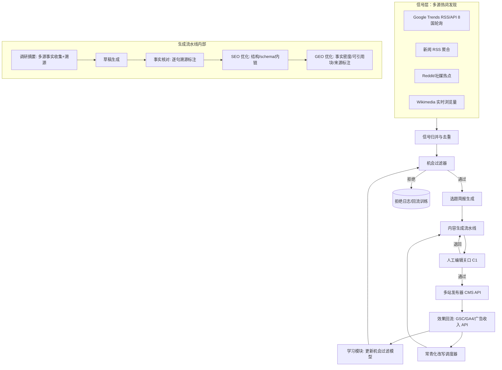
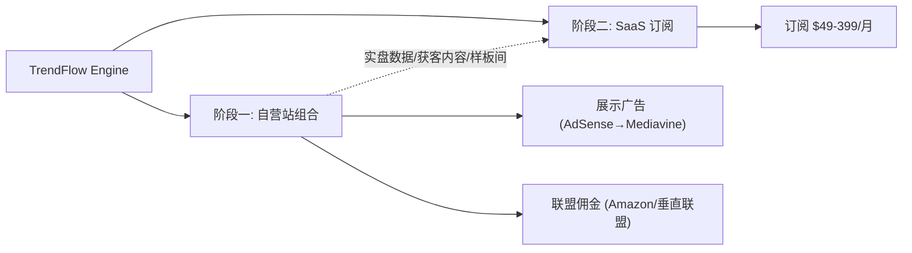
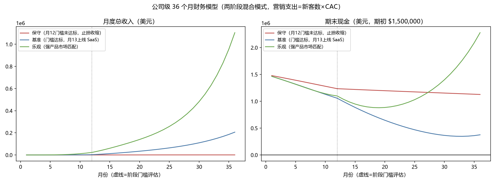
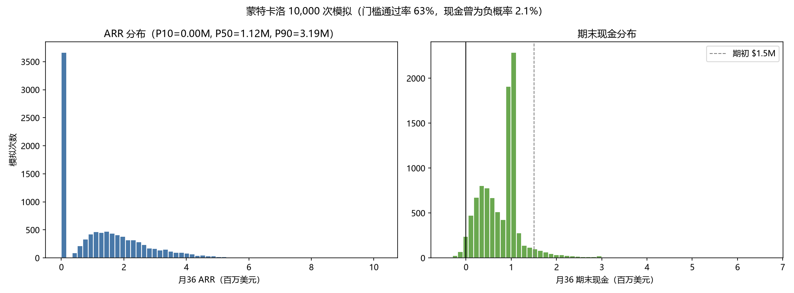
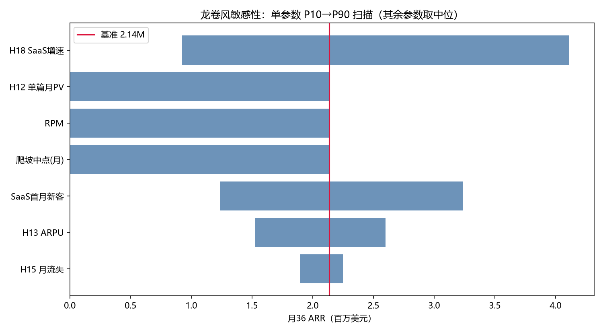
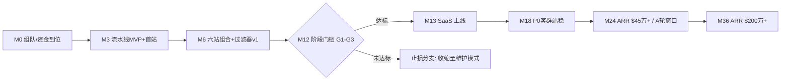

# 商业计划书 · 执行摘要

**项目代号：TrendFlow Engine**（谷歌热词 × SEO/GEO × 全自动 AI 导流引擎）
**日期**：2026-07-14（深化版）｜ **市场**：全球英文市场 ｜ **依据**：随附《商业机会挖掘与分析报告》（同仓库 `opportunity-report/`），全部数据可查证、计算可复现（46 条外部来源 + 9 个可复现 Python 脚本）

---

## 一句话

我们构建一台"从谷歌热词到被 AI 引用的成稿"分钟级全自动引擎，先用它运营自营网站组合把钱赚给自己看，再把被实盘验证的引擎卖给全球 SMB、站长与营销机构。

## 为什么是现在（三个已核实的结构性变化）

1. **速度成为流量的定价因子**：2025 年全年 278 个热点的实证显示，热词注意力半衰期中位数仅 2 天、前 3 天消耗 65% 的窗口价值——人工内容工作流（2–5 天）结构性追不上，市场把这部分流量留给了能分钟级响应的机器（`data/lifecycle_summary.json`，可复现）。
2. **搜索从"排名游戏"变为"引用游戏"**：AI Overview 下被引用者点击率是未被引用者的 2.3 倍 [S1]；懂 GEO 的内容生产是新的稀缺能力，而现有工具赛道集中在"监测"，执行层空白 [S24]。
3. **政策清场利好合规玩家**：Google 2024–2026 连续打击无编辑监督的批量 AI 内容（违规站流量 -50~80% [S7]），出清低质竞争者；我们的流水线以"AI 做 95% 的工 + 人做 5% 的判断"设计，合规护栏（C1–C5）写入产品。

## 商业模式：两阶段混合（机会报告评分 7.36/10 居首）

- **阶段一（月 1–12）自营验证**：滚动开设最多 8 个（基准）自营内容站——领域组合经 12 候选 × 6 准则量化评分选出（AI 工具评测、消费电子、家庭能源等 8 个独立领域，高 RPM 但高危的个人理财与名人八卦被合规黑名单否决，`scripts/08_niche_selection.py`）；引擎驱动"热词发现→机会过滤→AI 成稿+编辑关口→SEO/GEO 双轨优化→发布→效果回流"；广告+联盟变现。单篇成本 $8.01，基准情景单站第 17 月累计回本。GEO 工艺以量化实证为规格：schema 引用率 2.3 倍、语义完整度 r=0.87、正文具名来源 +2.1 倍等六因子写入流水线（第三章 3.4，[S31]–[S34]）。
- **阶段门槛（月 12，客观可检验）**：组合月 PV ≥10 万、月收入 ≥$1,500、近 3 月 PV 环比增速 ≥25%。未达标即止损收缩（保守情景演示：最大损失约期初资金 25%）。
- **阶段二（月 13–36）SaaS 产品化**：以实盘数据为信任资产对外销售订阅（定价 $49–399/月，混合 ARPU $99）；自营组合转为"永久样板间+获客内容渠道+效果数据源"。

## 市场与竞争

保守 TAM $107 亿、SAM $17.6 亿、3 年基准 SOM $530 万（双口径可复现，`data/market_sizing.json`）。竞争空位：Semrush/Ahrefs 是研究套件、Profound/Peec 是监测平台 [S22][S24]，无人提供"热词→成稿→双轨优化→发布"的闭环执行引擎；我们的护城河是随运营积累的私有效果数据集（哪类热词×哪类内容→何种流量/收入）与实盘背书。

## 财务摘要（三情景 36 个月 + 蒙特卡洛 10,000 次，`scripts/06/09` 可复现）

| 指标 | 保守（止损分支） | 基准 | 乐观 |
|---|---|---|---|
| 3 年收入合计 | $1.4 万 | $183 万 | $846 万 |
| 月 36 SaaS ARR | — | $214 万 | $1,115 万 |
| 月 36 付费客户 | — | ~1,800 | ~9,383 |
| 现金低谷（期初 $150 万） | $113 万 | $35 万（月 33） | $88 万（月 19） |
| 期末现金 | $113 万 | $38 万 | $228 万 |

**概率化结论（7 参数联合分布，10,000 次模拟）**：现金全程为正概率 97.8%；月 12 门槛通过概率 63%；月 36 ARR 中位数 $112 万（P90 $319 万）；ARR ≥$200 万概率 27%。基准情景位于全分布约 P73——它是"顺利情形"而非期望值，本计划书如实说明。SaaS 单客经济：LTV $1,716 / CAC $350 = 4.9，回收期 4.5 个月（流失与 CAC 假设已经 SMB SaaS 外部基准校准 [S38]–[S40]）。

## 融资

**种子轮 $150 万**，资金用途：产品研发 40% / 阶段一运营 25% / 阶段二 GTM 25% / 储备 10%。该额度经三情景压力测试与蒙特卡洛检验（97.8% 路径现金全程为正）：即使验证失败（约 37% 概率的止损分支），期末仍留存约 $100 万+ 现金与全部技术资产——**下行是部分损失而非归零**（赔率详表见第十三章）。

## 团队与执行原则

创始团队需覆盖三项能力：LLM 工程、SEO/GEO 增长、内容编辑运营（组织计划见第八章）。全项目执行三条铁律：**合规不可妥协（护栏 C1–C5）、每个阶段用客观数字验收、所有对外数据可查证可复现。**

---

# 第一章 问题与洞察

## 1.1 客户是谁，痛在哪

三类客户共享同一个未被满足的需求——"在 AI 搜索时代低成本获取高意图自然流量"：

| 客群 | 规模锚点 | 现状与痛点 |
|---|---|---|
| 付费做 SEO 的美国 SMB | 约 1,410 万家（3,620 万 × 39% [S27]），平均月支出 $497 [S29] | 花着钱但 75% 的低预算客户对服务商不满意 [S29]；不懂 GEO；人手追不上热点 |
| 职业站长 / 联盟营销者 | Amazon Associates 活跃者 90 万+ [S19] | 流量被 AI Overview 侵蚀（信息类查询点击率 8% vs 15% [S4]）；单人产能上限明显 |
| 营销/SEO 机构 | 全球约 43.7 万家 [S28]，美国 36.3 万家 [S29] | 交付依赖人力，AI 压缩传统服务价值；急需自动化工具维持毛利 |

## 1.2 三个被数据证实的洞察

**洞察一：热词流量是一块"人类吃不到"的蛋糕。**
本项目对 2025 年全年 278 个事件驱动热点的实证（`opportunity-report/03`）：注意力半衰期中位数 2 天，前 3 天消耗 65% 的 30 天窗口价值。传统内容工作流 2–5 天，到场时宴席已散。**这块蛋糕不是没人看见，是人追不上——它天然属于分钟级自动化系统。**

**洞察二：AI 搜索没有杀死内容流量，它把流量重新分配给了"会被引用的内容"。**
被 AI Overview 引用者 CTR 2.1%，未被引用者 0.9% [S1][S2]；AI 渠道访客价值 4.4 倍 [S4]。市场上绝大多数内容生产者（和他们的工具）还在为十年前的蓝链规则生产内容。**为"引用"而生产（事实密度、独特数据、可溯源结构）是新的工艺标准，尚未普及——先掌握者吃红利。**

**洞察三：合规成本是新的进入壁垒，而壁垒保护先行者。**
2026-03 核心更新后，无编辑监督的 AI 站流量 -50~80% [S7]。"纯自动"死了，"纯人工"追不上，**唯一活下来的形态是"AI 产能 + 人类判断"的混合流水线**——这需要工程、内容、合规三种能力的整合，模仿门槛远高于"接个 GPT API 批量生成"。

## 1.3 解决方案（一段话）

TrendFlow Engine：一条从"热词信号"到"已发布、已为 SEO 与 GEO 双面优化、经人工关口审核的成稿"的分钟级流水线，配备机会过滤器（变现潜力×竞争度×合规黑名单）与效果回流学习（发布后表现数据反哺选题模型）。先自营、后售卖（两阶段论证见机会报告第四章）。

## 1.4 为什么是我们能做成（诚实版）

- **不是技术秘密**：所有组件（Trends 数据、LLM、CMS）都是公开的。成败在于系统工程与数据飞轮的先发积累。
- **我们的可防御性来自三件事**：（1）阶段一实盘形成的私有效果数据集；（2）以数据集训练的机会过滤模型（决定单位经济的利润阀门）；（3）"实盘证明过"的销售信任资产——竞品用融资额讲故事，我们用自己的 Search Console 截图讲故事。
- **同时如实声明**：若阶段一验证失败（爬坡假设不成立），上述三件事都不成立，项目按阶段门槛止损——这个诚实的失败预案本身，是对投资人下行风险的保护（最大损失约期初资金 25%，见财务章）。

---

# 第二章 市场分析

本章数字全部继承自《商业机会挖掘与分析报告》第二章（来源交叉与口径讨论见彼处），此处按商业计划视角重组。

## 2.1 市场分层



本项目两阶段分别站在两个市场：阶段一是需求端的**参与者**（自营流量变现），阶段二是供给端的**卖水人**（SaaS 工具）。

## 2.2 TAM / SAM / SOM

计算：`scripts/03_market_sizing.py`（参数逐项标注来源/假设编号，敏感性分析内置）。

| 层 | 值 | 计算逻辑 |
|---|---|---|
| TAM | **$107.1 亿**（2025，保守口径；2028 年 $154.1 亿） | 取双口径较小者：自上而下（SEO 软件 $850 亿 × 12% 可服务份额 H1 + GEO $8.5 亿 × 60% SaaS 份额）vs 自下而上（$869.6 亿） |
| SAM | **$17.6 亿** | TAM × 47% 英文市场 [S19] × 35% 定位适配子群（H5） |
| SOM（3 年） | 保守 $180 万 / **基准 $530 万** / 乐观 $1,410 万 | SAM × 0.1% / 0.3% / 0.8% 市占 |

稳健性：假设 H1 取 8%–20% 区间时 TAM 为 $73 亿–175 亿，"十亿美元级可服务市场"结论全区间成立。SOM 乐观值对标 Peec AI（10 个月 $400 万 ARR [S24]）属"激进但有先例"。


## 2.3 客户细分与进入顺序

| 优先级 | 细分 | 定价档 | 进入理由 |
|---|---|---|---|
| P0（阶段二首发） | 职业站长/联盟营销者（prosumer） | $49–149/月 | 决策链短、痛点最尖锐（流量即收入）、与自营样板间画像相同，转化叙事零翻译成本 |
| P1（月 18+） | 中小营销机构 | $399/月（多工作区） | 一客多站、ARPU 高；机构渴求 AI 交付工具维持毛利 [S29] |
| P2（月 24+） | SMB 直客 | $49–99/月 | 量大但教育成本高，待产品自助化成熟后以内容获客规模化进入 |

## 2.4 客户痛点的一手证据（深化：竞品公开评价归纳）

P0 客群的痛点不再是推理，竞品用户的公开抱怨提供了直接证据 [S45][S46]：

| 抱怨主题（高频原话） | 证据 | 对本产品的验证意义 |
|---|---|---|
| "输出太 generic / cookie-cutter，要大量人工编辑" | Jasper 在 G2（1,270 条评价）与 Reddit 的第一大负面主题 [S45] | 验证"事实密度+溯源+GEO 工艺"的质量定位；也警示：AI 成稿工具的天花板是编辑成本，我们的编辑效率工具是卖点而非成本项 |
| "为什么不直接用 $20 的 ChatGPT"（42% 用户提及价格） | Jasper $49–69/席 vs ChatGPT $20 的价值质疑 [S45] | 单纯"AI 写作界面"无定价权；定价权来自闭环（选题→发布→效果），这恰是裸 LLM 做不了的 |
| "SEO 要另买 Surfer（≈$75/月），工具栈越叠越贵" | Jasper+Surfer+热词工具的叠加订阅结构 [S45][S46] | 一体化闭环工作流替代 $160+/月的三件套，$49–149 定价具备替代经济性 |
| "Surfer 的相关性打分鼓励堆词" | 方法论批评 [S46] | 引用因子规格（第三章 3.4）以外部实证研究为准绳，非自造相关性分数 |
| 计费/退订纠纷频发 | Jasper Trustpilot/Capterra 负面集中区 [S45] | 透明计费、随时可退是低成本的信任差异化（与诚实守信原则一致） |

**结论**：市场缺的不是"另一个 AI 写作工具"，而是"从热词到已发布已验证的闭环 + 值得信任的质量与计费"——痛点证据与我们的产品定义逐条对应。

## 2.5 市场时机与窗口

- **顺风**：GEO 赛道资本一年 $3 亿+ [S24] 教育了市场；Google 政策清场出清低质玩家 [S7]；LLM 成本降至单篇 $0.01 量级 [S26]。
- **逆风（如实呈现）**：AIO 覆盖率上升持续压缩信息类点击 [S4]；巨头套件（Semrush One、Ahrefs Brand Radar [S22][S23]）正在向 GEO 延伸。
- **判断**：执行层工作流的空位窗口估计 18–36 个月（推测）。本计划的阶段节奏（12 个月验证、13 个月起售卖）压在窗口内侧，无观望余地——这也是为什么阶段一必须同步研发产品化能力，而非串行。

---

# 第三章 产品与技术架构

## 3.1 产品定义

**TrendFlow Engine**：从热词信号到"已发布、已双轨优化、经编辑关口"成稿的分钟级自动化流水线。阶段一为内部引擎（驱动自营站组合），阶段二加上多租户外壳成为 SaaS。

## 3.2 系统架构



## 3.3 核心模块设计要点

**机会过滤器（利润阀门，核心 IP）**
对每个热词信号打分：预估搜索量 × 意图类型（交易/对比类优先——AIO 出现率与引用红利见 [S1][S2]）× 变现潜力（领域 RPM 表 [S14]）× 竞争度（现有 SERP 强度）× 窗口预测（生命周期模型，用本项目 lifecycle 方法论持续更新）× **合规黑名单**（YMYL 高危、公序良俗排除项，一票否决）。阈值以下不生产——盲目全量追热会拉低组合 RPM（机会报告 3.3）。

**内容生成流水线（质量与成本的平衡）**
多轮结构：调研摘要（多源事实收集，逐条记 URL）→ 草稿 → 事实核对（逐句与来源比对，不可溯源句子删除或标注）→ SEO 面（标题/结构/schema.org/内链）→ GEO 面（按 3.4 节工艺规格生成可引用结构）。经济层 LLM 即可胜任（单篇 $0.012 [S26]），模型可路由替换，无单一供应商依赖。

**人工编辑关口（合规护栏 C1，不可绕过）**
每篇 15 分钟人工审核：事实抽查、价值判断（"这篇对读者有真实增量吗"）、品牌语调。审核记录入审计日志。单篇编辑成本 $7.50，占成稿成本 94%——**我们把成本花在政策要求的地方**。编辑效率工具（差异高亮、来源一键核对）持续摊薄该成本。

**效果回流学习（数据飞轮）**
发布后 Search Console/GA4/广告收入数据按篇回流，形成"热词特征 × 内容类型 × 优化策略 → 流量/收入"私有数据集，持续再训练机会过滤器。**这个数据集是随时间加深的护城河，竞品（监测型工具）没有生产环节，无法积累。**

## 3.4 GEO 引用工艺规格（深化：产品核心竞争力的证据基础）

"被 AI 引用"不是玄学，2026 年已有可复现的量化研究。对 1,000 个 AI Overview、30 个垂直领域的抽样研究 [S31] 与多来源交叉 [S32][S33][S34] 给出了效应量，我们据此把工艺写成流水线的确定性规则：

| 引用因子（按效应量排序） | 实证效应 | 流水线实现（自动化程度） |
|---|---|---|
| 语义完整度（主题覆盖深度） | 与引用 r=0.87；8.5+/10 分页面被引用 4.2 倍 [S31] | 选题简报自动生成子问题簇（fan-out 覆盖），草稿必须逐一回答（全自动+编辑抽查） |
| Schema 结构化标记 | 引用率 2.3 倍 [S31]；被称为"最便宜的 2.3 倍杠杆" [S32] | FAQPage/HowTo/Article/Product schema 按页面类型自动注入，且与可见正文严格一致（全自动） |
| 正文内具名来源 | +2.1 倍 [S32]；96% 引用来自可验证权威来源 [S34] | 事实核对环节强制逐句溯源+外链具名（全自动+编辑复核） |
| 句子级可提取性 | 引用单位是句子而非页面：自足、具体、含数字的句子被整句提取 [S32] | 生成提示词强制"每个 H2/H3 首句 40–60 词直接作答"；模板禁用铺垫式开头 [S33]（全自动） |
| 多模态（图/表/视频） | 入选率 +156% [S31] | 数据表格自动生成；配图自动化；视频为后期选配（部分自动） |
| 长文+E-E-A-T | 2,500 词+ 引用率 +1.6 倍 [S32]；强 E-E-A-T 的第 6–10 名被引用率超弱 E-E-A-T 的第 1 名 [S31] | 作者页/资质署名/更新日期标准化组件；2025-12 核心更新后 E-E-A-T 适用于全部类目 [S34]（全自动模板） |

**约束（如实呈现）**：YMYL 领域须自然排名前 10 才有引用资格 [S32]——这与我们的 YMYL 黑名单策略互相印证：新站在 YMYL 领域连入场券都没有，回避是唯一理性选择。

该规格的商业含义：竞品（Jasper/Surfer 等）的输出被用户批评为"generic、需大量编辑、无 SEO 纵深" [S45][S46]，而上表六项没有一项完整存在于其产品中——**工艺规格本身即差异化**，且我们的效果回流数据将持续校准各因子权重（竞品没有生产-效果闭环，无法迭代）。

## 3.5 技术栈与研发计划

| 组件 | 选型 | 理由 |
|---|---|---|
| 流水线编排 | Python + 任务队列（Celery/Temporal） | 生态成熟，重试/审计友好 |
| LLM | 经济层多模型路由（Gemini Flash 级/GPT Nano 级/DeepSeek [S26]）+ 中间层复核 | 成本/质量分层，供应商冗余 |
| 发布端 | WordPress/Headless CMS API | 站群标准化，SaaS 阶段客户侧兼容面广 |
| 数据 | Postgres + 对象存储（审计日志、快照） | 常规 |
| SaaS 外壳（阶段二） | 多租户 Web 应用 + 计费（Stripe） | 常规 |

研发里程碑：M1–M3 流水线 MVP（单站跑通）；M4–M6 机会过滤器 v1 + 多站发布；M7–M12 效果回流学习 + 编辑效率工具 + 产品化预研；M13+ SaaS 多租户、计费、自助上手（前提：过阶段门槛）。

## 3.6 产品级合规护栏（C1–C5 的产品实现）

- 速率上限：单站单日发布量硬上限（防止客户用产品造垃圾站）；
- 编辑关口强制：未经人工确认不可发布（API 层强制，不可配置绕过）；
- 质量分门槛：低于阈值的草稿不进入发布队列；
- 选题黑名单：YMYL 高危与公序良俗排除项全局生效；
- 透明披露：产品文档如实说明平台风险与能力边界，不承诺"保证排名"；
- 法务自动化（第十一章的产品实现）：联盟链接就近自动插入 FTC 披露语 [S41]、隐私政策/Cookie 同意组件默认启用 [S44]。

---

# 第四章 商业模式与单位经济

## 4.1 收入结构（两阶段）



**阶段一：自营变现**
- 展示广告：新站从 AdSense（$3–12 RPM）起步，达到 5 万会话/月后升级 Mediavine（$15–40 RPM）[S14][S15]——广告网络升级本身就是内置的收入跳档机制；
- 联盟佣金：交易/对比类内容挂联盟链接，行业平均佣金 8.3% [S18]，AI 渠道流量转化率 14%（传统 2.8%）[S17]；
- 领域组合（深化：`scripts/08_niche_selection.py` 量化评分，12 个候选领域 × 6 项加权准则，逐项标注依据）：基准 8 站按评分序为 **AI/SaaS 工具评测（7.16）、消费电子对比（7.10）、家庭能源/电动出行（6.78）、旅行装备（6.28）、家居园艺（6.18）、食谱厨电（5.94）、宠物（5.62）、游戏攻略（5.24）**——跨 8 个独立领域分散算法风险；个人理财与名人八卦虽然分别有最高 RPM 与最高热词供给，但被合规黑名单一票否决（YMYL 高危/公序良俗风险）。组合均权 RPM 约 $14.2/千次，与财务模型基准 RPM=15 假设量级一致（详见 `data/niche_selection.json`）。


**阶段二：SaaS 订阅（月 13 起，须过阶段门槛）**

| 档位 | 定价 | 内容 | 对标锚点 |
|---|---|---|---|
| Starter | $49/月 | 1 站、每日热词简报、20 篇/月成稿额度 | Surfer $49 [S25]、Otterly $29 [S24] |
| Pro | $149/月 | 3 站、全自动流水线、GEO 优化、100 篇/月 | Exploding Topics $99–249 [S20] |
| Agency | $399/月 | 10 工作区、白标报告、API | Profound Growth $399 [S24] |

混合 ARPU 假设 $99/月（H13），定价处于竞品带宽中位，凭"执行闭环"（竞品只监测/只研究）与实盘背书取胜而非低价。

## 4.2 单位经济（`scripts/05_unit_economics.py` 可复现）

**内容单位：单篇成稿 $8.01**

| 成本项 | 金额 | 说明 |
|---|---|---|
| LLM（经济层多轮流水线） | $0.012 | 60K 输入 + 15K 输出 token [S26] |
| 人工编辑关口 | $7.50 | 15 分钟 × $30/时（合规护栏 C1） |
| 图片/结构化数据等 | $0.50 | |

即使 LLM 用中间层模型（Claude Sonnet 级）单篇也仅 $8.41——**LLM 价格对单位经济不敏感，编辑效率才敏感**。编辑工具每提效 20%，单篇成本降 $1.50。

**站点单位：单站月投入约 $541（60 篇 × $8.01 + $60 托管）**

| 情景 | 成熟期单篇月 PV | RPM | 月度盈亏平衡 | 累计回本 | 月 36 单月利润 |
|---|---|---|---|---|---|
| 保守 | 40 | $8 | 第 29 月 | 未回本 | $150 |
| 基准 | 120 | $15 | 第 11 月 | **第 17 月** | $3,347 |
| 乐观 | 300 | $25 | 第 6 月 | 第 9 月 | $15,659 |


**SaaS 客户单位**

| 指标 | 值 | 依据 |
|---|---|---|
| ARPU | $99/月 | H13，对标 [S20][S24][S25] |
| 毛利率 | 78% | H14（LLM 推理+基础设施成本后） |
| 月流失率 | 4.5% → 平均生命周期 22.2 月 | H15，SMB SaaS 常见带宽 |
| CAC | $350 | H16（内容驱动为主：自营站群即获客渠道） |
| **LTV** | **$1,716** | $99 × 78% × 22.2 |
| **LTV : CAC** | **4.9** | 健康线为 3 |
| CAC 回收期 | 4.5 个月 | |

## 4.3 成本结构与经营杠杆

- 阶段一主要成本：人员（研发+编辑池，月 $32K 基准）> 内容生产与托管（8 站满产月 $4.3K）> 基础设施（$2.5K）；
- 阶段二新增：获客（新客数 × $350）与客成团队；
- 杠杆点：引擎边际成本近零——每个新 SaaS 客户复用同一条流水线；效果数据集随客户量增长反而提升过滤器质量（数据网络效应）。

## 4.4 模式的诚实弱点

1. 阶段一收入爬坡慢（基准年 1 仅 $7.5K），前 12 个月几乎纯投入——种子资金因此按三情景现金低谷 + 安全垫设计（第 8 章）；
2. ARPU $99 的假设依赖 prosumer 与机构分层成功，若客户集中在 Starter 档，ARPU 降至 ~$60，月 36 ARR 相应打 6 折（敏感性详见第 8 章）；
3. 流失率 4.5% 是行业常见值而非我们的实测值，阶段二前 6 个月的留存数据是该假设的第一次真实检验。

---

# 第五章 竞争分析

## 5.1 竞争地图

按"研究 → 监测 → 执行"的价值链定位（定价与融资均已核实 [S20]–[S25]）：

| 玩家 | 定位 | 定价 | 融资/体量 | 与本项目关系 |
|---|---|---|---|---|
| Semrush | SEO 全家桶（研究为主） | $139.95–499.95/月；One 系列 $199–549 | 上市公司 | 提供数据不提供执行；GEO 功能浅 [S24] |
| Ahrefs | SEO 数据（研究为主） | $29–1,499/月；Brand Radar €179/月起 | 私营大厂 | 同上 |
| Exploding Topics | 热词发现 | $39–249/月，API $1,000+/月 | Semrush 系 | 只发现不执行；是我们信号层的对标（我们自建多源信号） |
| Glimpse | Trends 增强 | ~$71/月起 | 小型 | 同上 |
| Profound | GEO 监测（企业级） | $99–399/月，企业 $2,000–5,000+ | $155M，估值 $1B [S24] | 监测+少量内容生成（3 篇/月）；服务 F500，与我们客群错位 |
| Peec AI | GEO 监测（中端） | €89–499/月 | $29.1M，ARR $4M+ [S24] | 纯监测 |
| Otterly | GEO 监测（入门） | $29–489/月 | 未披露 | 纯监测 |
| Surfer/Jasper | 内容优化/生成 | $49–299/月 | 成熟 | 单点工具，无热词触发、无发布闭环、无 GEO 面 |

## 5.2 空位论证

现有玩家覆盖"你该写什么"（研究）与"你被 AI 提到了吗"（监测），**没有人交付"从热词到已发布的双轨优化成稿"的执行闭环**。原因不难理解：
- 研究/监测工具是纯软件问题，执行闭环要求工程+内容工艺+合规运营三合一，重且脏；
- 头部玩家（Profound）向企业市场走（客单价 $30K–100K/年 [S24]），无动力做 prosumer 执行工具；
- 巨头套件受制于"不能教用户批量生产内容"的品牌合规顾虑，反而是创业公司以"编辑关口+质量护栏"设计能占住的差异化位置。

## 5.3 竞争推演与应对

| 情形 | 概率（推测） | 应对 |
|---|---|---|
| Semrush/Ahrefs 套件补齐 GEO 执行功能 | 高（24 个月内） | 打深度不打广度：他们的执行功能将是套件附件，我们是全部；同时以效果数据集建立切换成本 |
| Profound 下探 prosumer | 中 | 其定价结构（$399 起才可用 [S24]）与销售模式（sales-led）下探成本高；我们以自助+低价卡位 |
| 新创业者复制两阶段打法 | 高（打法公开后） | 先发数据飞轮：效果数据集的积累量=时间×站点数，后来者按日历时间落后 |
| 价格战 | 中 | 单位经济健康（毛利 78%、LTV:CAC 4.9），有降价空间；但优先以实盘背书维持溢价 |

## 5.4 护城河总结（按强度排序，诚实评级）

1. **私有效果数据集与数据网络效应**（强，随时间加深）：生产→发布→效果回流的闭环数据，监测型竞品结构上无法获得；
2. **实盘信任资产**（中强，可验证不可伪造）：自营组合的公开可查业绩；
3. **合规工艺积累**（中）：编辑关口效率工具与质量体系，可被模仿但需时间；
4. **品牌/规模**（当前无）：如实承认，这是我们与 Profound 们的差距，靠前三项换时间。

---

# 第六章 Go-to-Market 与运营计划

## 6.1 阶段一（月 1–12）：自营运营即市场准备

阶段一没有"销售"，但每个动作都在为阶段二铺路：

| 月份 | 运营动作 | 阶段二资产沉淀 |
|---|---|---|
| M1–M3 | 首站上线（1 个高 RPM 领域），流水线 MVP 跑通；建立编辑 SOP | 流水线可行性证据 |
| M4–M6 | 扩至 4–6 站（领域分散）；机会过滤器 v1；申请广告网络 | 首批效果数据；SOP 成型 |
| M7–M9 | 满配 8 站（基准）；效果回流学习上线；开始公开"Build in Public"复盘（流量数据、方法论博客/推特） | 获客内容池 + 早期受众 |
| M10–M12 | 冲刺阶段门槛；组织 50–100 人的候补名单（waitlist）与 10–20 名设计伙伴（design partner）访谈 | 阶段二首批客户管道 |

**Build in Public 是本项目 GTM 的核心杠杆**：自营站的真实数据（Search Console 曲线、收入截图、失败复盘）就是最好的营销内容——真实、稀缺、竞品无法复制，且与"讲实话"的原则一致。

## 6.2 阶段二（月 13–36）：分层获客

**P0 prosumer（月 13–18）**：
- 渠道：waitlist 转化 + Build in Public 受众 + 站长社区（Reddit r/juststart、r/SEO、Indie Hackers）+ 联盟计划（本项目设定佣金 25%，处于 SaaS 行业 20–70% 惯例区间的低端 [S17]）；
- 转化叙事："这是我们自己赚钱用的引擎，数据在这里"；
- 目标：月 13 新客 20 名起，月增 12%（H18，财务模型基准）。

**P1 机构（月 18–24）**：Agency 档 + 白标报告；从 prosumer 客户中的机构从业者向上转化；参加 SEO 行业会议。

**P2 SMB 直客（月 24+）**：产品自助化成熟后，以 SEO 内容（用自家引擎生产——产品即渠道）与集成市场（WordPress 插件目录）规模化获客。

**获客成本纪律**：模型按 CAC $350（H16）拨备；实际 CAC 连续 3 个月 >$500 时触发渠道复盘，>$700 时冻结付费投放（LTV:CAC 跌破 2.5 的红线管理）。

## 6.3 运营组织（与财务模型人力口径一致）

| 阶段 | 编制 | 月人力成本 |
|---|---|---|
| 阶段一 | 4 人：2 工程（流水线/数据）+ 1 主编（编辑关口+SOP）+ 1 增长运营（站群+BiP） | $32K（H19） |
| 阶段二 | 6 人：+1 产品工程 +1 客户成功 | $50K |
| 乐观扩张 | 8–9 人 | $70K |

编辑关口产能核算：8 站 × 60 篇/月 = 480 篇，×15 分钟 = 120 小时/月。主编（编审+抽查复核）+ 按篇计酬的自由编辑池承担，成本已按 $30/时全额计入单篇成本，无隐藏产能缺口。

## 6.4 运营质量指标（月度复盘，客观可检验）

- 内容：编辑关口退回率（目标 <20%，过高=生成质量问题）、发布时延（热词出现→发布，目标 P50 <6 小时）；
- 流量：组合 PV 环比、AI 引用率（被 AIO/ChatGPT 引用的监测抽样）、Mediavine 门槛进度；
- 变现：组合 RPM、联盟 EPC；
- SaaS（阶段二）：激活率（首周发布 ≥1 篇）、月流失、NPS。
每月复盘会对照本表，连续 2 个月恶化的指标必须立项修复——小问题早处理。

---

# 第七章 财务计划

模型：`scripts/06_financial_model.py`（月度明细 `data/financial_model_monthly.csv`，汇总 `data/financial_model.json`）。所有参数继承单位经济模型（`scripts/05_unit_economics.py`）并在脚本内标注假设编号；修改任一参数重跑脚本即可得到新结果——本章数字与脚本输出逐一对应。

## 7.1 模型结构

- 月度现金流，36 个月，期初现金 $150 万（种子轮）；
- 阶段一（月 1–12）：按各情景开站计划滚动开站，每站每月 60 篇（$8.01/篇）+ $60 托管；流量按站龄逻辑斯蒂爬坡（H12）；
- 月 12 阶段门槛：G1 组合月 PV ≥100K；G2 组合月收入 ≥$1,500；G3 近 3 月 PV 环比 ≥25%（阈值=基准轨迹月 12 实绩的约 60%）；
- 阶段二（月 13–36）：过门槛则 SaaS 上线（新客 = 首月基数 × 月增速，营销支出 = 新客数 × CAC $350，不重复计费）；未过门槛则演示止损分支（停产、团队降至维护规模、保留存量站现金流）；
- 保守情景 = 门槛未过（爬坡假设失败）；基准/乐观 = 门槛通过后两档增长。

## 7.2 三情景汇总

| 指标 | 保守（止损分支） | 基准 | 乐观 |
|---|---|---|---|
| 年 1 收入 | $399 | $7,492 | $68,955 |
| 年 2 收入 | $5,188 | $341,638 | $1,446,525 |
| 年 3 收入 | $8,148 | $1,480,160 | $6,948,985 |
| 月 36 SaaS 客户数 | 0 | ~1,800 | ~9,383 |
| 月 36 ARR | — | $2,138,028 | $11,146,680 |
| 月 12 组合 PV | 17,224 | 170,254 | 923,575 |
| 现金低谷（月） | $1,127,315（36） | $347,376（33） | $880,139（19） |
| 期末现金 | $1,127,315 | $375,757 | $2,278,437 |
| 单月现金流转正 | 未转正 | 月 34 | 月 20 |
| 现金跑道 | 全程为正 | 全程为正 | 全程为正 |



三情景现金全程为正：$150 万种子资金经压力测试足额（含保守情景的止损分支）。

## 7.3 关键解读（讲实话）

1. **保守情景就是"失败情景"，我们把它印在计划书里。** 若月 12 门槛未过，止损分支保住 $113 万现金（期初的 75%）与全部技术资产。投资下行有界、可预先知晓——这是阶段门槛制的资本价值。
2. **基准情景的现金低谷出现在月 33（$35 万），安全但不宽裕。** 若 SaaS 增速低于 12%/月，需要在月 24–30 之间以 ARR 数据启动 A 轮或放缓招聘——两个备选方案都已在跑道内。
3. **年 1 收入几乎可以忽略（基准 $7.5K）。** 阶段一的产出不是收入，是三样资产：被验证的引擎、效果数据集、阶段二的信任背书。任何把年 1 收入包装得更好看的做法都是自欺。
4. **乐观情景不是拍脑袋**：其 SOM 对应值（月 36 ARR $1,115 万）低于赛道先例（Profound 18 个月 $1B 估值隐含的 ARR 倍数 [S24]），处于"强 PMF 情形下可达"区间。

## 7.4 风险量化：蒙特卡洛模拟（深化，`scripts/09_monte_carlo.py`）

三情景只是三个切片。为回答"各种情形以多大概率发生"，我们对 7 个关键参数设概率分布（分布锚点逐项标注：H12 对数正态覆盖保守 40~乐观 300；RPM 三角(8,15,25) [S14]；流失三角(3%,4.5%,8%) 对齐 SMB SaaS 基准 [S38][S39][S40]；ARPU 三角(59,99,129) 对标竞品定价带 [S20][S24][S25]；增速/首月新客为经营假设），固定随机种子做 **10,000 次全流程模拟**（含阶段门槛的分支逻辑）：

| 概率结论 | 数值 |
|---|---|
| 月 12 阶段门槛通过概率 | **63%** |
| 现金曾跌破零的概率 | **2.2%**（且集中于门槛通过后扩张期，门槛通过条件下为 3.4%） |
| 月 36 ARR | P10 = $0（门槛未过）；**P50 = $112 万**；P90 = $319 万 |
| 月 36 ARR ≥ $100 万概率 | 53% |
| 月 36 ARR ≥ $200 万（≈基准情景）概率 | 27% |
| 门槛通过条件下的 ARR 中位数 | $181 万 |
| 期末现金 | P10 = $21 万 / P50 = $95 万 / P90 = $114 万 |



**解读（讲实话）**：
1. 全参数不确定性下，约 37% 的情形止步于阶段一（ARR 分布中 0 处的峰即止损分支）——但这些情形期末现金中位仍在百万美元级，损失有界；
2. 基准情景（ARR $214 万）位于全分布的 P73 附近——**它是"顺利情形"而非"期望值"**，本计划书如实说明这一点；机构决策建议以 P50（$112 万）为规划锚点；
3. 期初 $150 万资金在 97.8% 的路径中现金全程为正，资金规模经得起联合不确定性检验。

**龙卷风敏感性**（单参数 P10→P90 扫描，其余取中位）：



排序结论：**H18 SaaS 增速是最大价值敏感项**（ARR $92 万–$411 万）；H12 爬坡/RPM/爬坡时点三者的下行是"二值型"风险——差到一定程度直接触发门槛止损（ARR=0），这正是门槛制把连续下行风险转化为有界损失的机制在敏感性图上的直观体现；流失率的敏感度最低（$190 万–$225 万），因为增长期新增远大于流失。管理含义：资源优先投向 SaaS 获客引擎（第六章）与阶段一爬坡（第十二章周计划），而非过度打磨留存。

## 7.5 资金用途（$150 万）

| 用途 | 占比 | 金额 | 说明 |
|---|---|---|---|
| 产品研发（流水线+过滤器+SaaS 化） | 40% | $60 万 | 工程人力为主 |
| 阶段一运营（站群内容+编辑+基础设施） | 25% | $37.5 万 | 12 个月 × ~$3 万 |
| 阶段二 GTM（获客+客成） | 25% | $37.5 万 | 门槛通过后解锁 |
| 储备 | 10% | $15 万 | 应对复合恶化情形 |

GTM 预算与门槛绑定：未过门槛不解锁，直接转入止损分支——资金纪律写入章程。

---

# 第八章 团队、组织与融资

## 8.1 团队要求（能力矩阵）

本项目成败于三种能力的整合，创始团队必须原生覆盖，不可全部外包：

| 能力 | 承担角色 | 关键任务 | 招聘/合伙标准 |
|---|---|---|---|
| LLM 工程与数据 | 技术合伙人 + 1 工程师 | 流水线、机会过滤器、效果回流学习 | 有生产级 LLM 应用与数据管道交付记录 |
| SEO/GEO 增长 | 创始人/增长负责人 | 站群策略、双轨优化工艺、BiP 获客 | 有可验证的自然流量增长案例（Search Console 为证） |
| 内容编辑与合规运营 | 主编 | 编辑关口 SOP、质量体系、黑名单治理 | 英文母语级编辑能力 + 出版/媒体质量控制经验 |

组织节奏（与财务模型一致）：阶段一 4 人（$32K/月）→ 阶段二 6 人（$50K/月）→ 乐观 8–9 人。刻意保持小团队：本项目的杠杆在引擎而非人头，人效（人均 ARR）为组织扩张的约束指标（阶段二目标人均 ARR ≥$25 万）。

## 8.2 治理与执行原则（写入公司章程/股东协议的可执行条款）

1. **阶段门槛的强制力**：月 12 门槛（G1–G3）未达标时，GTM 预算（$37.5 万）不得解锁，公司进入止损分支；变更此条款须投资人同意——把"自我革命"从口号变成合同；
2. **合规护栏 C1–C5 为不可妥协条款**：任何以绕过编辑关口换取增长的提案自动否决；
3. **数据诚信**：所有对外披露的业绩数据须可溯源（Search Console/Stripe 原始记录）；
4. **月度复盘制度**：对照第六章质量指标表复盘，纪要留档，连续恶化指标强制立项。

## 8.3 融资方案

**本轮：种子轮 $150 万。**

- 定价依据：三情景现金流压力测试（第七章）——覆盖基准情景全程（低谷 $35 万仍为正）与保守情景止损分支（期末留存 $113 万）；
- 里程碑承诺：月 12 阶段门槛数据全量披露给投资人（无论好坏）；月 24 目标 ARR $45 万+（基准轨迹为月 24 ARR 约 $47.8 万，见 `data/financial_model_monthly.csv`）；
- 后续轮次：基准情景下月 24–30 凭 ARR 增长数据启动 A 轮（用途：机构市场扩张与国际化）；若 SaaS 增速超预期（乐观轨迹），A 轮提前；
- **对投资人的诚实声明**：本项目的最大单一风险是流量爬坡假设（H12）在月 12 前无法完全验证；作为对价，阶段门槛制把该风险的损失上界锁定在期初资金的约 25%，且失败情形下仍保有技术资产与存量现金流的残值。

## 8.4 股权与激励（原则性框架）

- 创始团队期权池预留 12–15%（阶段二关键岗位：产品工程、客户成功）；
- 编辑池采用按篇计酬 + 质量奖金（退回率倒挂），不占股权；
- 里程碑挂钩：核心团队部分期权与阶段门槛/ARR 里程碑绑定，与投资人利益同向。

---

# 第九章 路线图与里程碑（阶段目标 + 客观可检验标准）

依据总纲第十八条：先定可分解的阶段目标，再用客观、可检验的标准衡量结果；目标未达时先查原因、再调方案。每个里程碑给出**验收标准（可由第三方核验的数字）**与**未达预案**。

## 9.1 总览



## 9.2 里程碑明细

| 里程碑 | 时点 | 验收标准（客观可检验） | 未达预案 |
|---|---|---|---|
| M3：流水线 MVP | 月 3 | 首站上线并连续 4 周稳定产出（≥60 篇/月）；热词→发布 P50 时延 <24 小时；编辑退回率 <35% | 时延/退回率超标：暂停扩站，先修流水线（工程规律：先试点后扩大） |
| M6：组合成型 | 月 6 | 4–6 站覆盖 ≥4 个独立领域；机会过滤器 v1 上线（拒绝率与理由留档）；组合月 PV ≥7,000 且连续 2 月环比 >30%（阈值=基准轨迹月 6 实绩 11,153 的约 60%，与 M12 门槛同一折算逻辑） | PV 未达但增速健康：继续；增速也未达：冻结开站，逐站诊断 |
| **M12：阶段门槛** | 月 12 | **G1 组合月 PV ≥100,000；G2 组合月收入 ≥$1,500；G3 近 3 月 PV 环比 ≥25%**（阈值=基准轨迹月 12 实绩 170K PV/$2,554 的约 60%） | **未达即执行止损分支**：停产收缩至维护模式，保留存量现金流与技术资产（保守情景演示：期末现金 $113 万）；GTM 预算不解锁 |
| M13：SaaS 上线 | 月 13 | 首月付费客户 ≥15（模型假设 20）；激活率（首周发布 ≥1 篇）≥60% | 客户 <10：回炉 waitlist/定价，延后 1–2 月，用运营储备金 |
| M18：P0 站稳 | 月 18 | 付费客户 ≥130（基准轨迹 147）；月流失 ≤6%；ARR ≥$15 万 | 流失 >6%：冻结获客投放，全力修激活与留存（先治本再放量） |
| M24：A 轮窗口 | 月 24 | ARR ≥$45 万（基准轨迹 $47.8 万）；LTV:CAC ≥3；机构档客户 ≥15 家 | ARR $30–45 万：不融资，放缓招聘走自足路线；<$30 万：战略复盘（含出售/合并选项，见第十章） |
| M36：规模验证 | 月 36 | ARR ≥$200 万（基准轨迹 $214 万）；人均 ARR ≥$25 万；现金流为正（基准轨迹月 34 转正） | 按差距幅度在"继续独立增长/被并购/利润化经营"三选项间决策 |

## 9.3 决策纪律

- 每个里程碑评估会输出书面结论：达标证据（数据链接）、未达原因分析（区分执行问题 vs 假设错误）、方案调整；
- **假设错误与执行问题分开处理**：执行问题修执行（换打法），假设错误改模型（重跑 `scripts/` 全链并更新计划）——不许用"再给一个月"模糊两者；
- 所有指标以原始系统数据为准（Search Console、GA4、Stripe、广告网络后台），禁止人工汇总口径。

---

# 第十章 风险应对与退出机制

风险识别与定级继承机会报告第五章风险登记册（R1–R8），本章聚焦"应对动作的执行安排"与退出机制。

## 10.1 风险应对的执行安排

| 风险 | 应对动作（谁/何时/做什么） | 触发器（客观） |
|---|---|---|
| R1 算法更新冲击 | 增长负责人：每次 Google 核心更新后 72 小时内出组合影响报告；领域分散（≥6 领域）与 GEO 第二分发面为常备缓冲；邮件订阅从 M4 起建设（目标 M12 订阅 1 万） | 组合 PV 单周 -20%：启动逐站诊断；-40%：暂停开站 |
| R2 零点击加深 | 主编：选题配比每季度再平衡（交易/对比类占比 ≥60%）；变现结构向联盟/线索倾斜 | 组合 RPM 连续 2 月下降 >15% |
| R3 热词数据源变更 | 工程：信号层四源冗余（Trends/新闻 RSS/社媒/Wikimedia）常态运行，任一源失效自动降级 | 任一源连续 48 小时不可用 |
| R4 巨头竞争 | 创始人：季度竞品功能扫描；差异化坚持"执行闭环+效果数据"纵深 | 头部竞品发布执行类功能：30 天内出对位分析与路线调整 |
| R5 LLM 成本/条款 | 工程：多模型路由常备 3 家可切换 | 单篇 LLM 成本 >$0.50 或条款禁止性变更 |
| R6 广告门槛不达 | 增长：联盟收入线并行（不依赖广告网络升级）；保守情景已按 RPM=8 建模 | M9 无站达到 Mediavine 申请线：变现结构复盘 |
| R7 内容责任 | 主编：YMYL 黑名单+逐句溯源+公开更正机制；抽查率 10% | 单月事实性投诉 ≥3 起：抽查率提至 30% |
| R8 爬坡假设失败 | 全员：M12 阶段门槛如实执行（第九章） | G1–G3 未达标 |

## 10.2 退出机制（对创始人与投资人都诚实）

**止损退出（M12 门槛未过）**：
- 停止新内容生产与开站，团队缩编至维护规模（模型：月支出 $4.8K）；
- 资产处置选项（估值已核实为市场数据）：存量站点组合出售——Empire Flippers 2025 年内容站平均成交倍数约 **24 倍月净利**（2024 年 27 倍，连续三年下行后的理性定价）[S35]，第三方汇总的展示广告站区间 28–38 倍、下滑期站点仅 12–20 倍 [S37]。**诚实评估：止损情形下我们的站点属"下滑/未起量"类，按 12–20 倍下沿甚至流拍计，残值以"聊胜于无"入账，不计入投资回收测算**；买方市场对纯内容站明显转冷（EF 2026 年报：内容站作为独立资产收购风险上升，买家更青睐有转型/协同价值的标的 [S36]）；
- 引擎技术资产授权或出售（无公开市场基准，不估值）；
- 保守情景演示的财务底线：期末现金 $113 万（这是有据的底线；站点与技术残值为其上的或有增量）。
- 蒙特卡洛量化（`data/monte_carlo.json`）：止损分支发生概率约 37%，该分支下期末现金中位数仍在百万美元级——损失上界有界且可预知。

**中期出路（M24 评估，ARR $30–45 万区间）**：
- 利润化经营：停止烧钱扩张，SaaS 毛利 78% 支持小团队盈利运营；
- 战略出售：向 SEO 套件巨头（补执行能力）或 GEO 头部（补生产环节）出售——第五章竞争推演显示两类买家都有补齐动机。

**成功退出（M36+，基准/乐观轨迹）**：
- A 轮后独立增长至 ARR $1,000 万+，对标赛道估值（Profound $1B/155M 融资 [S24]）走后续轮或并购；
- 赛道并购活跃（一年融资 $3 亿+，整合必然发生），执行层资产与效果数据集是稀缺标的。

## 10.3 本计划最脆弱的三个假设（批评与自我批评，深化后复核）

以投资人视角自我审视，本计划书最可能错的三处，如实列出（深化调研后的最新校准状态）：

1. **H12 流量爬坡（成熟期单篇月 PV 120）**：无公开权威基准，方差极大——蒙特卡洛按对数正态（P10≈44，P90≈325）建模后，它与 RPM、爬坡时点共同构成 37% 的止损概率。对冲：门槛制把该连续风险转化为有界损失（龙卷风图上表现为"二值型"截断）。**深化后状态：已量化，未消除**——只有实盘能消除。
2. **H18 SaaS 增速（月 12%）**：龙卷风图第一敏感项（ARR $92 万–$411 万）。H15 流失（4.5%）已经外部基准校准（SMB SaaS 月流失 3–5% [S38][S39]），风险降级；但增速仍是纯经营假设。对冲：M18 触发器 + 蒙特卡洛已按 4%–18% 全带宽计入。
3. **GEO 窗口期 18–36 个月（推测）**：若巨头 12 个月内补齐执行功能，阶段二溢价空间收窄。对冲：这是无法完全对冲的赛道风险，只能以执行速度应对——这也是为什么本计划所有节点都压在最快可行节奏上。
4. **（深化新增）内容站残值假设的进一步弱化**：调研显示内容站二级市场买方转冷 [S35][S36]，本版已将止损残值从"30–40 倍月利"下修为"不计入回收测算"。若市场进一步恶化，影响的是止损分支的或有增量而非底线现金——底线结论不变。

---

# 第十一章 法务与合规（深化新增）

平台政策合规（Google 反垃圾体系，护栏 C1–C5）已在第三章与机会报告第五章覆盖。本章覆盖其余法律合规面：广告法、数据隐私、版权、实体结构。原则：**合规是产品功能，不是法务负担**——凡可自动化的合规动作一律写进引擎。

> 声明：本章为经营合规规划，不构成法律意见；公司设立与重大合同签署前须聘请执业律师复核（依据总纲第十条：高风险领域的最终决策交由具备资质的专业者）。

## 11.1 广告与联盟披露（FTC，美国流量主要合规面）

| 要求 | 依据 | 引擎实现 |
|---|---|---|
| 联盟佣金属"重大关联"，须清晰醒目披露；披露须与推荐内容/链接同屏可见，页脚统一声明不合规 | FTC Endorsement Guides（16 CFR Part 255，2023 修订）[S41] | 发布器检测联盟链接，自动在内容首屏与链接就近处插入标准披露语（如 "We may earn a commission from links on this page"），模板不可删除 |
| 禁止虚假/AI 生成的用户评价与体验声明；AI 参与的推广内容仍须真实 | FTC Consumer Reviews and Testimonials Rule（2024 定案）[S42] | 内容模板禁用第一人称虚构体验（"我用了三个月"类句式进黑名单）；产品评测只基于可核实的公开规格与数据对比，不虚构使用经历 |
| 排名/推荐不得被未披露的商业关系扭曲 | 16 CFR 255 示例条款 [S41] | 对比页排序逻辑与佣金脱钩并公示方法论页 |

**SaaS 阶段的延伸**：披露自动化作为产品功能交付给客户（客户的联盟内容自动合规），这把合规成本转化为卖点。

## 11.2 数据隐私（GDPR / CCPA）

内容站与 SaaS 的数据足迹不同，分别处理 [S44]：

- **自营内容站（阶段一）**：收集面最小化——分析（GA4）+ 广告 Cookie + 邮件订阅。合规集：隐私政策与 Cookie 政策页（模板化）、欧盟流量 Cookie 同意横幅（CMP 组件）、退订与数据删除通道。只要触达欧盟/加州用户即适用，与经营者所在地无关 [S44]；
- **SaaS（阶段二）**：客户账户数据 + 客户站点数据（GSC/GA4 授权）。合规集：DPA（数据处理协议）模板、数据最小化（只拉取效果指标必需字段）、删除即销毁；目标客户含欧洲时评估数据驻留选项；
- 成本入模型：CMP 组件与隐私工具订阅计入基础设施月费（INFRA_MONTHLY $2,500 内），无需追加预算。

## 11.3 版权与内容权属（AI 生成内容的特殊性）

- **美国版权局立场**：纯 AI 生成作品不受版权保护，仅人类创作部分可登记；登记须披露超过最低限度的 AI 生成内容 [S43]；
- **经营含义（如实呈现）**：本项目内容资产的法律可保护性弱于传统人工内容——竞争者复制单篇内容的法律屏障有限。**我们的应对不是假装拥有版权，而是把防御建立在别处**：数据飞轮、发布速度、域名权威度（这些无法被复制粘贴）。人工编辑关口的实质性参与同时提升可保护性（第二重价值）；
- **输入侧风险**：流水线的"调研摘要"环节聚合外部事实——事实本身不受版权保护，但表达受保护。工艺规则：只提取事实与数据并注明来源，禁止改写式抄袭（逐句溯源机制天然留有证据链）；图片仅用自产图表、授权图库与官方媒体包 [S44]。

## 11.4 实体结构与资金合规

- **实体**：美国特拉华 C-Corp（SaaS 融资标准结构，投资人惯例），银行/Stripe/广告网络收款闭环走公司账户——财务闭环、正规渠道（总纲第六条）；
- **子女实体不设**：站群资产直接持于公司名下，出售时资产交割简单；
- **税务**：广告/联盟收入（美国来源）与 SaaS 订阅收入均入美国实体报税；创始团队所在地个税各自合规（细节由税务师落地）；
- **合同底稿**（M1 前备妥）：编辑承揽合同（含保密与署名条款）、SaaS 服务条款与 SLA、隐私政策、DPA。

## 11.5 合规成本汇总（入财务模型核对）

| 项目 | 一次性 | 经常性 | 模型科目 |
|---|---|---|---|
| 公司设立 + 合同底稿律师费 | ~$8–15K（H27 估计） | — | 期初储备金（$15 万储备内） |
| CMP/隐私工具 | — | ~$100–300/月 | INFRA_MONTHLY 内 |
| 年度法务顾问 | — | ~$5–10K/年（H27） | INFRA_MONTHLY 内可覆盖 |
| FTC/隐私违规风险敞口 | 罚则存在但合规成本低——按上表执行后为低残余风险 | — | 风险登记册新增 R9（低） |

合规总成本占三年支出 <1%，**不合规的期望损失（处罚+信任崩塌）远大于合规成本**——数学上和道德上都只有一个正确选择。

---

# 第十二章 前 90 天执行计划（深化新增：周级）

依据可执行原则（总纲第十五条）：每项任务回答"谁、在什么条件下、用什么资源、分几步做"。角色代号：**ENG-1**（技术合伙人/流水线）、**ENG-2**（工程师/数据与发布）、**ED**（主编）、**GRW**(增长运营，兼创始人业务面)。前提条件：资金到账、四人到位、第十一章合同底稿签署。

## 第 1–2 周：地基

| # | 任务 | 负责 | 完成标准（客观） |
|---|---|---|---|
| 1.1 | 实体/银行/Stripe/域名注册（首站=评分第 1 领域：AI/SaaS 工具评测，`data/niche_selection.json`） | GRW | 账户可收付款；域名+托管+CDN 可用 |
| 1.2 | 信号层 v0：Google Trends RSS 8 国轮询 + 新闻 RSS 聚合（复用本 BP 的 01 号脚本架构） | ENG-2 | 每小时入库，去重后日均 ≥200 条信号 |
| 1.3 | 生成流水线 v0：调研摘要→草稿→逐句溯源三环节打通（经济层 LLM 路由） | ENG-1 | 给定选题 30 分钟内产出带来源标注草稿 |
| 1.4 | 编辑 SOP v1 + 审核工具选型（差异高亮、来源一键核对） | ED | SOP 文档 + 单篇审核 ≤20 分钟实测 |

## 第 3–4 周：首站上线

| # | 任务 | 负责 | 完成标准 |
|---|---|---|---|
| 2.1 | 首站主题架构：领域子问题簇地图（按 3.4 节语义完整度因子设计） | ED+GRW | 覆盖 ≥120 个子查询的选题树 |
| 2.2 | SEO/GEO 优化环节接入流水线：schema 自动注入、H2/H3 首句直答模板、FTC 披露自动插入 | ENG-1 | 抽检 10 篇全部通过结构校验（Rich Results 测试） |
| 2.3 | 首站发布 20 篇创刊内容（热点 10 + 常青 10）并提交 GSC | 全员 | 全部经编辑关口；GSC 收录 ≥50% |
| 2.4 | E-E-A-T 组件：作者页、方法论页、更正政策页、隐私/Cookie 组件 | ENG-2 | 页面上线且 CMP 对欧盟流量生效 |

## 第 5–8 周：节奏与第二三站

| # | 任务 | 负责 | 完成标准 |
|---|---|---|---|
| 3.1 | 首站进入稳态生产：60 篇/月节奏 | ED 主导 | 连续 4 周 ≥14 篇/周；编辑退回率 <35% |
| 3.2 | 热词→发布时延优化 | ENG-1 | P50 时延 <24h（M3 验收线），P50<6h 为 M6 目标 |
| 3.3 | 开站 2、3 号（消费电子、家庭能源，评分第 2/3） | ENG-2+GRW | 复用流水线开站耗时 ≤3 天/站 |
| 3.4 | 机会过滤器 v0.5：意图分类 + RPM 领域映射 + 合规黑名单硬编码 | ENG-1 | 拒绝理由留档；抽检误杀率 <20% |
| 3.5 | Build in Public 启动：首篇方法论复盘（真实数据） | GRW | 发布并沉淀首批 ≥100 关注者 |

## 第 9–12 周：数据回流与 M3 验收

| # | 任务 | 负责 | 完成标准 |
|---|---|---|---|
| 4.1 | 效果回流 v0：GSC/GA4 按篇入库，周报自动生成 | ENG-2 | 每篇内容的展现/点击/引用抽样可查 |
| 4.2 | AIO 引用监测抽样：核心 50 词的引用状态周度快照 | ENG-2 | 周度快照入库（自建脚本，暂不买监测工具） |
| 4.3 | 首月数据复盘会：校准 H12 爬坡假设的第一个实测点 | 全员 | 书面结论：实测 vs 模型偏差与调整动作 |
| 4.4 | **M3 里程碑验收**（第九章）：首站 ≥60 篇/月稳定、时延 P50<24h、退回率 <35% | 全员 | 三项全过→按计划扩站；任一未过→冻结扩站修流水线 |

## 资源与预算（90 天）

- 人力：4 人 × 3 月 ≈ $96K（按阶段一 $32K/月）；
- 非人力：域名/托管/CDN/工具 + LLM + 法务设立 ≈ $15–20K；
- 合计约 $115K，占种子资金 7.7%——用 <8% 的资金买到流水线可行性与 H12 的首批实测数据点，是全计划资本效率最高的 90 天。

## 失败预案（第 12 周复盘时判定）

- 流水线可行但爬坡数据弱于保守情景轨迹：继续至 M6 再判（新站 3 个月数据噪声大，不过早下结论）；
- 流水线不可行（时延/质量/成本任一严重超标且无修复路径）：这是比 M12 门槛更早的止损信号，启动技术复盘，最大损失锁定在 ~$115K + 遣散成本。

---

# 第十三章 成功概率与赔率（深化新增）

依据总纲第十六条：预测用概率和区间表达，不作绝对断言。本章把"这个项目能不能成"翻译成可检验的概率语言，由两条独立路径交叉：模型内概率（蒙特卡洛，`scripts/09_monte_carlo.py`，固定种子可复现）与模型外基率（类比参照系）。

## 13.1 成功的定义（先定义再谈概率）

| 层级 | 定义（月 36 时点） | 含义 |
|---|---|---|
| 底线成功 | 现金全程为正 + 止损纪律被执行 | 资本得到保护，无论业务结果 |
| 经营成功 | SaaS ARR ≥ $100 万 | 业务自立，可自足或融 A 轮 |
| 风投级成功 | ARR ≥ $200 万且增速健康 | 对标赛道头部轨迹（Peec AI 10 个月 $400 万 ARR [S24]） |

## 13.2 模型内概率（蒙特卡洛，10,000 次，7 参数联合分布）

| 事件 | 概率 | 备注 |
|---|---|---|
| 底线成功（现金全程为正） | **97.8%** | 失败的 2.2% 集中于门槛通过后的扩张期，可用月度现金监控进一步压缩 |
| 月 12 阶段门槛通过 | **63%** | 即阶段一验证成功率约六成——我们如实呈现：这不是高确定性事件 |
| 经营成功（ARR ≥ $100 万） | **53%** | |
| 风投级成功（ARR ≥ $200 万） | **27%** | 基准情景位于全分布约 P73，属"顺利情形" |
| ARR 中位数（门槛通过条件下） | $181 万 | 区间见 `data/monte_carlo.json` |

**模型的局限（诚实声明）**：蒙特卡洛只量化了模型内 7 个参数的不确定性；模型外风险（Google 政策突变、巨头 12 个月内补齐执行功能、团队执行失误）未在分布中，实际概率应在上表基础上向下修正。

## 13.3 模型外基率（类比参照系校验）

- **SaaS 创业基率**：种子期 SaaS 到 A 轮的转化率行业常见口径约 20–40%（宽区间，口径混杂，仅作量级参照）——本项目"风投级成功 27%"落在该带宽内，模型未给出反常乐观的输出（总纲第六条：反常必有妖，此处无反常）；
- **赛道基率**：GEO 赛道一年融资 $3 亿+、Profound 18 个月 $1B、Peec 10 个月 $4M ARR [S24]——赛道处于"资本与需求双热"阶段，成功案例密度高于 SaaS 平均；
- **反面基率**：内容站独立经营的买方市场转冷 [S35][S36]——印证了机会报告对"路径 B 天花板有限"的判断，两阶段结构（内容站只是验证场而非终局）正确规避了该逆风。

## 13.4 赔率表达（给投资人的诚实换算）

以种子轮 $150 万计（下述为模型内数字的直观翻译，非收益承诺）：

- **~37% 概率**：止步阶段一，公司留存约 $100 万+ 现金与技术资产，损失上界约为投入的 25–30%——**下行是"部分损失"而非"归零"**，这在种子投资中是结构性优势；
- **~10% 概率**：门槛通过但 ARR < $100 万（63% − 53%），公司进入"利润化小生意或战略出售"分支（第十章中期出路）；
- **~26% 概率**：ARR $100–200 万（53% − 27%），健康 SaaS，A 轮可选；
- **~27% 概率**：ARR ≥ $200 万（其中 P90 达 $319 万），进入风投回报区间。
- （各分支按 `data/monte_carlo.json` 分布切分：36.7% + 10.2% + 26.0% + 27.1% = 100%，自洽）

**一句话赔率**：这是一笔"下行有界（约七成本金保护）、上行对标 27% 概率进入风投区间"的结构化风险投资——结构优势来自阶段门槛制，而非对任一乐观假设的信仰。

## 13.5 概率的动态更新承诺

上述概率是 2026-07 时点、当前证据下的估计。承诺的更新机制：M3/M6/M12 每次里程碑复盘后，用实测数据替换对应分布参数重跑 `scripts/09_monte_carlo.py`，向董事会披露更新后的概率——**让概率随证据流动，不让立场固化概率**（总纲第二十一条）。

---

# 附录

## 附录 A 商业模式画布（BMC）

| 模块 | 内容 |
|---|---|
| 客户细分 | P0 职业站长/联盟营销者；P1 中小营销机构；P2 SMB 直客（阶段一时客户=自己） |
| 价值主张 | 分钟级"热词→已发布的 SEO/GEO 双轨优化成稿"执行闭环；实盘验证背书；合规内建 |
| 渠道 | Build in Public 内容、站长社区、联盟计划、产品自获客（用引擎做自己的 SEO）、集成市场 |
| 客户关系 | 自助订阅 + 机构档客成；公开方法论社区 |
| 收入流 | 阶段一：展示广告+联盟佣金；阶段二：订阅 $49/149/399 三档 |
| 核心资源 | 引擎代码、私有效果数据集、编辑 SOP 与质量体系、自营站组合 |
| 关键活动 | 流水线研发、站群运营、效果数据回流、GTM |
| 关键伙伴 | LLM 供应商（多家路由）、广告网络（AdSense/Mediavine）、联盟网络（Amazon 等）、CMS 生态 |
| 成本结构 | 人员（最大项）、内容编辑关口、获客（新客×$350）、基础设施 |

## 附录 B 精益画布补充项

- **最重要指标（One Metric）**：阶段一=组合月 PV 环比增速；阶段二=净 MRR 增长；
- **不公平优势**：自营实盘的公开可验证业绩 + 生产-效果闭环数据（结构上竞品拿不到）；
- **最大风险假设**：H12 流量爬坡（详见第十章 10.3），M12 门槛即其检验实验。

## 附录 C 可复现性清单（任何第三方可执行）

```powershell
py -m pip install -r requirements.txt
py scripts/01_fetch_trending_now.py    # 一手热词快照（结果随时点变化，方法可复现）
py scripts/02_trend_lifecycle.py       # 2025 年热点生命周期（历史数据，结果可精确复现）
py scripts/03_market_sizing.py         # TAM/SAM/SOM（参数开源，可精确复现）
py scripts/04_opportunity_scoring.py   # 机会评分（打分依据逐项标注，可审计）
py scripts/05_unit_economics.py        # 单位经济（可精确复现）
py scripts/06_financial_model.py       # 财务三情景（可精确复现）
py scripts/08_niche_selection.py       # 阶段一领域组合评分（可审计）
py scripts/09_monte_carlo.py           # 蒙特卡洛 10,000 次（固定种子，可精确复现）
```

## 附录 D 引用来源

全部外部引用（S1–S46，含 URL、访问日期、关键数据点、口径说明）见项目根目录 **`SOURCES.md`**；一手数据原始快照见 `data/raw/`；假设编号（H1–H27）在对应脚本与章节内注明依据与敏感性区间。

## 附录 E 文档结构索引

| 文档 | 内容 |
|---|---|
| `opportunity-report/00–06` | 商业机会挖掘与分析报告（方法论、市场、一手实证、路径评分、风险合规、结论） |
| `business-plan/00–14` | 本商业计划书（11 法务合规、12 前 90 天周级计划、13 成功概率与赔率为深化版新增） |
| `scripts/01–09` | 全部可复现计算（08 领域选择、09 蒙特卡洛为深化版新增） |
| `data/` | 一手数据、模型输出、月度财务明细 |
| `assets/` | 脚本生成图表 |
