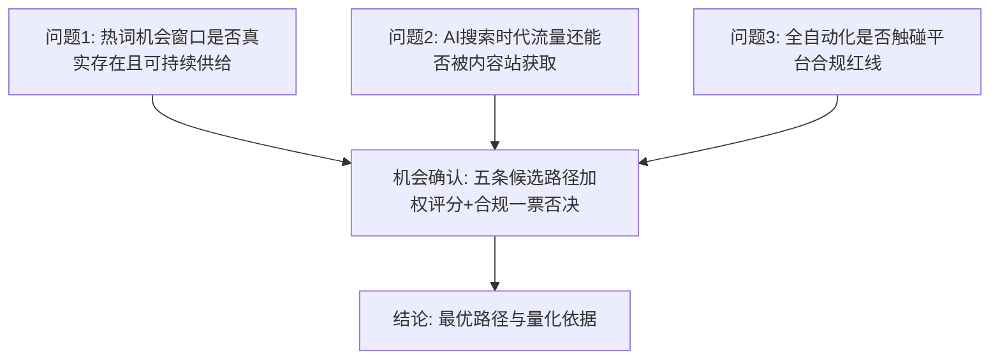

# 第一章 方法论与数据来源

## 1.1 研究问题

本报告要回答一个可证伪的问题：

> **"利用谷歌热词分析 + SEO/GEO，基于全自动软件与 AI，将搜索需求快速导流到自有网站"——这件事在 2026 年的搜索生态下，是否还是一门合规、可持续、值得投入的生意？如果是，最优的进入路径是什么？**

我们不预设答案。研究过程中若发现该模式不成立，报告将如实给出否定结论。

## 1.2 分析框架

四个前置问题各自独立取证：

| 问题 | 取证方法 | 产出 |
|---|---|---|
| 热词窗口存在性 | 一手采集：Google Trends Trending-Now RSS 8 国快照 | `data/trending_now.csv` |
| 热词生命周期 | 一手采集：Wikimedia Pageviews 开放数据，2025 年 12 个采样日 Top50 文章 ±60 天逐日浏览量，量化爆发-衰减规律 | `data/lifecycle_metrics.csv` |
| 流量可获取性 | 三方交叉：Seer Interactive（547 万查询）、Ahrefs（30 万关键词）、Pew Research 面板 [S1]–[S4] | 第二章 |
| 合规红线 | Google Search Central 官方政策原文 + 执法案例 [S5]–[S8] | 第五章 |
| 市场规模 | 三家机构交叉 + 自上而下/自下而上双口径测算 | `data/market_sizing.json` |
| 路径比选 | 8 准则加权评分模型 + 合规一票否决 | `data/opportunity_scores.json` |

## 1.3 数据诚信规则

本报告全部数字分为三类，规则如下：

1. **引用类**：标注来源编号（如 [S1]），详情（URL、访问日期、原始口径）见项目根目录 `SOURCES.md`；
2. **计算类**：标注生成脚本（如 `scripts/03_market_sizing.py`），参数与公式开源，任何第三方运行 `py scripts/xx.py` 即可复现；
3. **假设类**：标注假设编号（如 H1），在脚本内注明依据锚点与敏感性区间，正文明示"此为推测"。

无出处、不可复现、未标注为假设的数字，一律不得出现在本报告中。

## 1.4 已知局限（自我批评）

如实声明本研究方法的局限，供读者校准置信度：

1. **行业博客类来源精度有限**：RPM 基准（[S14]–[S16]）、竞品定价（[S20]–[S25]）部分来自行业博客与工具站的运营者调查，非审计数据。处理方式：只采用区间而非点值，且多来源交叉，取交集口径。
2. **维基百科浏览量是搜索热度的代理变量**：两者同源（同一事件驱动）但不等同；维基数据偏向"知识型"热点，可能低估纯商业热词（如产品发布）的生命周期差异。选它的原因是 Google Trends 不提供绝对量逐日历史 API，而维基数据开放、绝对量、可复现——可复现性优先于完美性。
3. **市场规模报告口径不一**：SEO 软件市场三家机构 CAGR 预测差异大（7.89%–13.65%），我们取保守折中并做敏感性分析；GEO 市场报告来自新兴研究机构，成熟度低于 Gartner 级，报告中已按"早期赛道估计值"降权使用。
4. **热词快照是时点数据**：Trending-Now RSS 为单日快照，长期供给稳定性依赖 Google 持续提供该数据源（第五章列为平台依赖风险）。
5. **财务模型的爬坡假设（H12）无公开权威基准**：新站自然流量爬坡曲线因领域、竞争、执行差异极大，模型参数为经营假设，唯一可靠的校准方式是阶段一实盘——这本身就是"先自营验证"路径的立论依据之一。
