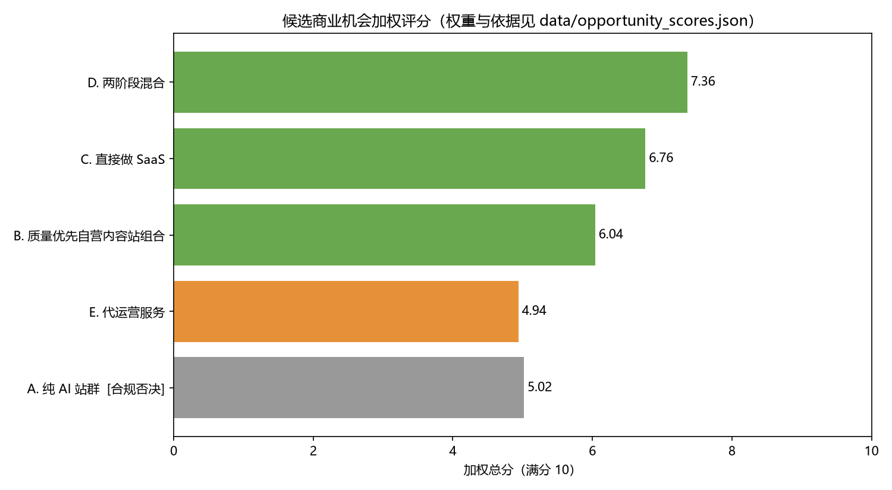
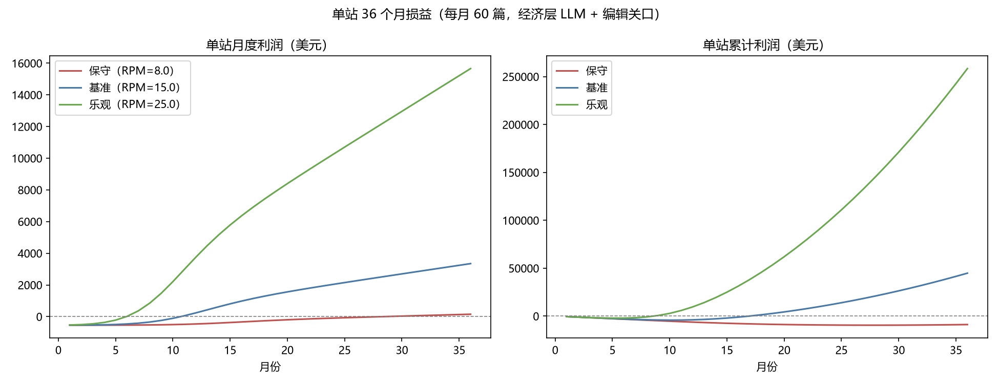

# 第四章 候选路径深度剖析与评分

## 4.1 候选路径枚举

"热词 + SEO/GEO + 全自动 AI 导流"这一能力组合，存在五条可辨识的商业化路径：

| 路径 | 一句话定义 | 收入形态 |
|---|---|---|
| A. 纯 AI 站群 | 无编辑监督，程序化批量生成页面收割搜索流量 | 广告/联盟 |
| B. 质量优先自营组合 | 热词驱动+编辑监督的自营内容站组合 | 广告/联盟 |
| C. 直接做 SaaS | 把引擎做成工具卖给站长/机构/品牌 | 订阅 |
| D. 两阶段混合 | 先自营验证（B），达标后产品化（C） | 广告/联盟 → 订阅 |
| E. 代运营服务 | 用引擎为客户站点做代运营 | 服务费 |

## 4.2 评分模型

由 `scripts/04_opportunity_scoring.py` 实现，8 项准则加权（合规安全与自动化可行性各 0.18 为最高权重——它们是本项目的两大主要矛盾），每个分值附打分依据与来源编号，完整明细见 `data/opportunity_scores.json`。**合规安全分 ≤2 触发一票否决**（理由：违规处罚是移除索引=收入归零，毁灭性尾部风险不可用加权平均稀释；且违背总纲）。

**结果：**

| 排名 | 路径 | 加权总分 | 状态 |
|---|---|---|---|
| 1 | **D. 两阶段混合** | **7.36** | 入选 |
| 2 | C. 直接做 SaaS | 6.76 | 备选 |
| 3 | B. 质量优先自营组合 | 6.04 | 并入 D 阶段一 |
| 4 | E. 代运营服务 | 4.94 | 排除（不符全自动定位） |
| — | A. 纯 AI 站群 | (5.02) | **合规一票否决** |

## 4.3 深度剖析

### 路径 A：纯 AI 站群 —— 证伪（详见第五章 5.3）

技术可行性最高（9 分）恰是其毁灭原因：零门槛导致海量供给，Google 以政策+算法双重出清 [S5][S7]。期望收益为负，且不合规。**结论：不能做。**

### 路径 B：质量优先自营组合 —— 可行但天花板有限

单位经济（`scripts/05_unit_economics.py`，参数见脚本）：

- 单篇成稿直接成本 **$8.01**（经济层 LLM $0.012 + 人工编辑关口 $7.50 + 杂项 $0.50）——注意：成本大头是合规要求的人工关口，而非 AI；这决定了"质量优先"与"全自动"的现实平衡点是**"AI 做 95% 的工，人做 5% 的判断"**。
- 单站（每月 60 篇）36 个月三情景：

| 情景 | 成熟期单篇月 PV | RPM | 单月盈亏平衡 | 累计回本 | 月 36 单月利润 |
|---|---|---|---|---|---|
| 保守 | 40 | $8 | 第 29 月 | 36 月内未回本 | $150 |
| 基准 | 120 | $15 | 第 11 月 | 第 17 月 | $3,347 |
| 乐观 | 300 | $25 | 第 6 月 | 第 9 月 | $15,659 |

**判断**：基准/乐观情景下是一门利润率健康的现金流生意，但收入随站点数线性增长、受平台算法风险约束，缺少复利结构。作为独立终局不够，作为验证场和现金流基座很好。

### 路径 C：直接做 SaaS —— 市场对，冷启动错

市场端一切就绪（SAM $17.6 亿、GEO 赛道 CAGR 38.5–50.5%、一年融资 $3 亿+ [S12][S13][S24]）。但本赛道 SaaS 销售的核心难题是**效果可信度**：客户买的是"流量结果"，而新工具没有实盘证据。现有竞品的解法是融资烧钱做品牌（Profound $155M [S24]）。对资源有限的新进入者，无证据直接销售意味着高 CAC 和长销售周期。

### 路径 D：两阶段混合 —— 入选

以 B 解 C 的死结：

1. **信任资产**：自营组合的实盘数据（"我们用同一引擎做出了 X 流量/$Y 收入，数据可查"）是任何竞品监测工具都没有的销售武器；
2. **数据资产**：阶段一沉淀"哪类热词 × 哪类内容 × 何种优化 → 何种流量/收入"的私有效果数据集，反哺引擎的机会过滤模型，构成随时间加深的护城河；
3. **资本效率**：引擎一次开发、两次变现；自营现金流部分覆盖研发；
4. **风险有界**：阶段门槛制（月 12 客观指标）天然内置止损机制——财务模型保守情景（门槛未过、收缩至维护模式）期末现金仍为正（`data/financial_model.json`：$1,127,315 / 期初 $1,500,000，最大损失约为期初资金的 25%）。

**代价（如实呈现）**：比 C 慢 12 个月进入 SaaS 市场；若赛道窗口在 12 个月内被头部锁死，D 的机会成本高于 C。我们判断该风险可控：GEO 工具渗透率仍低（市场 2025 年仅 $8.5 亿，对应 SAM 渗透 <5%），且竞品集中于"监测"而非"执行"，工作流空位仍在 [S24]。

### 路径 E：代运营服务 —— 排除

美国 36.3 万家同行、年流失率 38%、65% 客户换过 2+ 家供应商 [S29]：结构性红海+无规模经济，与"全自动软件"定位相悖。仅保留为阶段二的可选补充收入线（用工具反哺少量高客单代运营客户）。
