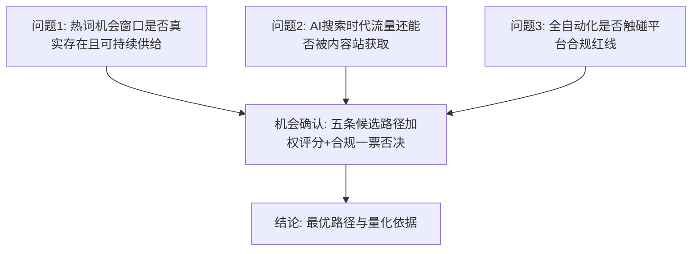
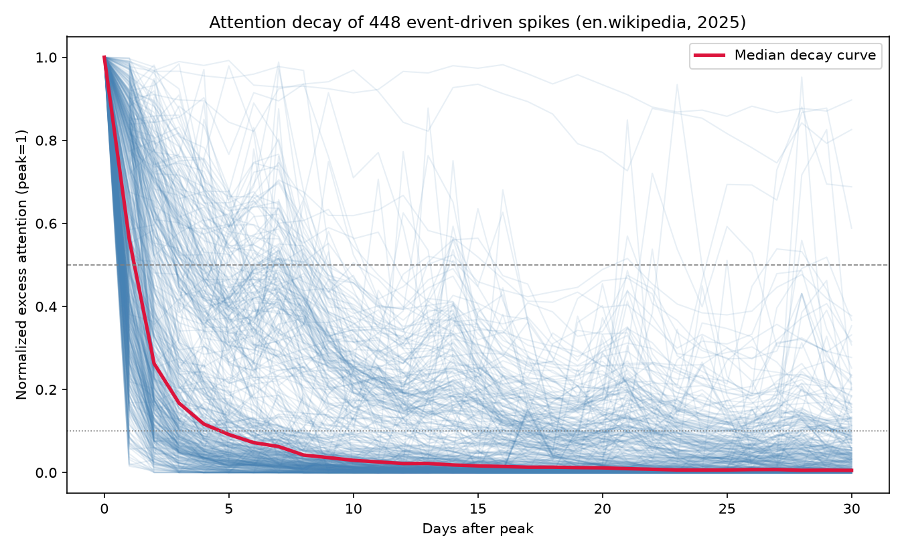
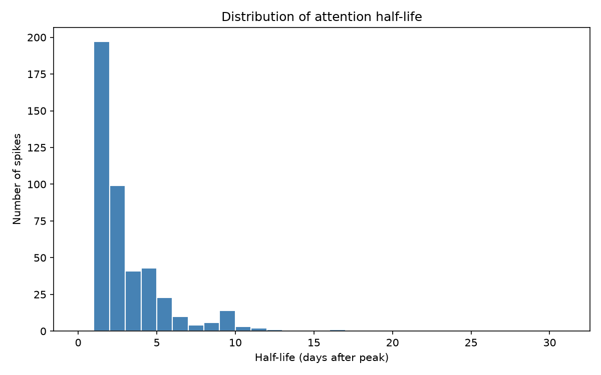

# 商业机会挖掘与分析报告
## 谷歌热词 × SEO/GEO × 全自动 AI 导流

**执行摘要**（完成日期：2026-07-14；全部数据来源见 `SOURCES.md`，全部计算可由 `scripts/` 复现）

---

## 一、研究问题与结论

**问题**：利用谷歌热词分析 + SEO/GEO，基于全自动软件与 AI，将搜索需求快速导流到自有网站——在 2026 年的搜索生态下，这是否还是一门合规、可持续、值得投入的生意？

**结论：机会成立，但只有一条路走得通。** 经五条候选路径的加权评分与合规审查（可复现模型 `scripts/04_opportunity_scoring.py`）：

- **入选：两阶段混合模式（7.36/10）**——阶段一以全自动引擎（含人工编辑关口）运营自营内容站组合，实盘验证并产生现金流；月 12 依客观阶段门槛决策；达标后进入阶段二，将引擎产品化为 SaaS 对外销售。
- **证伪：纯 AI 站群（合规一票否决）**——该模式与 Google《规模化内容滥用》政策的违规定义逐字吻合 [S5]，2026 年 3 月核心更新后此类站点流量已下降 50–80% [S7]，期望收益为负且不合规，明确不能做。

## 二、支撑结论的四组关键证据

**1. 热词窗口真实存在，且短到只有机器追得上（一手数据）。**
本项目直接采集：Google Trends 8 国实时快照显示热词滚动供给、单词搜索量下界 100–100,000 次/日；对 2025 年全年 448 个事件驱动型热点的注意力分析显示，**半衰期中位数仅 2 天，前 3 天消耗 30 天窗口内 64% 的注意力**（`data/lifecycle_summary.json`）。人工工作流（2–5 天）结构性追不上，分钟级自动化流水线是该市场的入场券——这正是"全自动软件+AI"的价值锚点。

**2. AI 搜索改写了流量规则：从"排名游戏"变为"引用游戏"。**
出现 AI Overview 时自然 CTR 从 3.2% 压至 1.3–2.4%，但**被 AI 引用者的点击率是未被引用者的 2.3 倍**（2.1% vs 0.9%）[S1][S2]；AI 渠道访客价值约为传统的 4.4 倍、联盟转化率 14% vs 2.8% [S4][S17]。SEO+GEO 双轨优化因此成为必需能力，也是本项目区别于传统 SEO 工具的定位依据。

**3. 合规是过滤器，也是护城河。**
Google 政策打击"无价值+批量+操纵意图"，不打击 AI 工具本身 [S5][S7]。合规解：AI 做 95% 的工、人做 5% 的判断（编辑关口）。单篇成稿成本 $8.01，其中编辑关口 $7.50、LLM 仅 $0.012（`scripts/05_unit_economics.py`）——**政策清场正在出清不合规的低质竞争者，利好合规自动化玩家。**

**4. 市场规模与时机。**
保守 TAM $107 亿、SAM $17.6 亿（自上而下/自下而上双口径交叉，`scripts/03_market_sizing.py`）；GEO 工具赛道 2025 年 $8.5 亿、CAGR 38.5–50.5%，一年融资超 $3 亿，头部 Profound 18 个月成独角兽 [S12][S13][S24]；但现有玩家集中于"监测"，"热词→成稿→SEO/GEO 双轨优化"的**执行层全自动工作流仍是空位**。机会赏味期估计 18–36 个月（推测），支持快进入、阶段验证。

## 三、经济性摘要（三情景，全部可复现）

| 指标 | 保守 | 基准 | 乐观 |
|---|---|---|---|
| 单站累计回本 | 36 月内未回本 | 第 17 月 | 第 9 月 |
| 月 12 组合自然 PV | 1.7 万 | 17 万 | 92 万 |
| 3 年收入合计 | $1.4 万（止损分支） | $183 万 | $846 万 |
| 月 36 SaaS ARR | —（未上线） | $214 万 | $1,115 万 |
| 期末现金（期初 $150 万） | $113 万 | $38 万 | $228 万 |

保守情景演示阶段门槛的止损价值：验证失败时最大损失约为期初资金的 25%，其余以现金与技术资产留存。SaaS 单客经济：LTV $1,716 / CAC $350（LTV:CAC = 4.9）、回收期 4.5 个月。

## 四、主要风险（详见第五章风险登记册）

平台算法依赖（R1，高概率中冲击）、零点击加深（R2）、巨头套件化竞争（R4）、流量爬坡假设不确定（R8，以阶段门槛控制损失上界）。最脆弱的三个假设已如实标注：H12 流量爬坡曲线、H18 SaaS 获客增速、GEO 窗口期长度——三者均只能靠阶段一实盘校准，这本身就是两阶段路径的立论依据。

---

**章节目录**：01 方法论与数据来源 ｜ 02 宏观趋势与市场格局 ｜ 03 机会识别（热词窗口一手实证）｜ 04 候选路径深度剖析与评分 ｜ 05 风险与合规专章 ｜ 06 结论：机会确认与进入路径

---

# 第一章 方法论与数据来源

## 1.1 研究问题

本报告要回答一个可证伪的问题：

> **"利用谷歌热词分析 + SEO/GEO，基于全自动软件与 AI，将搜索需求快速导流到自有网站"——这件事在 2026 年的搜索生态下，是否还是一门合规、可持续、值得投入的生意？如果是，最优的进入路径是什么？**

我们不预设答案。研究过程中若发现该模式不成立，报告将如实给出否定结论。

## 1.2 分析框架

四个前置问题各自独立取证：

| 问题 | 取证方法 | 产出 |
|---|---|---|
| 热词窗口存在性 | 一手采集：Google Trends Trending-Now RSS 8 国快照 | `data/trending_now.csv` |
| 热词生命周期 | 一手采集：Wikimedia Pageviews 开放数据，2025 年 12 个采样日 Top50 文章 ±60 天逐日浏览量，量化爆发-衰减规律 | `data/lifecycle_metrics.csv` |
| 流量可获取性 | 三方交叉：Seer Interactive（547 万查询）、Ahrefs（30 万关键词）、Pew Research 面板 [S1]–[S4] | 第二章 |
| 合规红线 | Google Search Central 官方政策原文 + 执法案例 [S5]–[S8] | 第五章 |
| 市场规模 | 三家机构交叉 + 自上而下/自下而上双口径测算 | `data/market_sizing.json` |
| 路径比选 | 8 准则加权评分模型 + 合规一票否决 | `data/opportunity_scores.json` |

## 1.3 数据诚信规则

本报告全部数字分为三类，规则如下：

1. **引用类**：标注来源编号（如 [S1]），详情（URL、访问日期、原始口径）见项目根目录 `SOURCES.md`；
2. **计算类**：标注生成脚本（如 `scripts/03_market_sizing.py`），参数与公式开源，任何第三方运行 `py scripts/xx.py` 即可复现；
3. **假设类**：标注假设编号（如 H1），在脚本内注明依据锚点与敏感性区间，正文明示"此为推测"。

无出处、不可复现、未标注为假设的数字，一律不得出现在本报告中。

## 1.4 已知局限（自我批评）

如实声明本研究方法的局限，供读者校准置信度：

1. **行业博客类来源精度有限**：RPM 基准（[S14]–[S16]）、竞品定价（[S20]–[S25]）部分来自行业博客与工具站的运营者调查，非审计数据。处理方式：只采用区间而非点值，且多来源交叉，取交集口径。
2. **维基百科浏览量是搜索热度的代理变量**：两者同源（同一事件驱动）但不等同；维基数据偏向"知识型"热点，可能低估纯商业热词（如产品发布）的生命周期差异。选它的原因是 Google Trends 不提供绝对量逐日历史 API，而维基数据开放、绝对量、可复现——可复现性优先于完美性。
3. **市场规模报告口径不一**：SEO 软件市场三家机构 CAGR 预测差异大（7.89%–13.65%），我们取保守折中并做敏感性分析；GEO 市场报告来自新兴研究机构，成熟度低于 Gartner 级，报告中已按"早期赛道估计值"降权使用。
4. **热词快照是时点数据**：Trending-Now RSS 为单日快照，长期供给稳定性依赖 Google 持续提供该数据源（第五章列为平台依赖风险）。
5. **财务模型的爬坡假设（H12）无公开权威基准**：新站自然流量爬坡曲线因领域、竞争、执行差异极大，模型参数为经营假设，唯一可靠的校准方式是阶段一实盘——这本身就是"先自营验证"路径的立论依据之一。

---

# 第二章 宏观趋势与市场格局：AI 正在重写搜索流量的分配规则

## 2.1 核心事实：搜索流量分配发生了结构性变化

2024–2026 年，Google 搜索结果页发生了自其诞生以来最大的一次流量再分配。三组独立研究交叉印证：

**（1）AI Overview 大幅压低传统自然点击。**
Seer Interactive 对 53 个品牌、547 万查询、24.3 亿次自然展现的 14 个月追踪 [S1]：

| 时点 | 有 AI Overview 的查询自然 CTR | 无 AI Overview 的查询自然 CTR |
|---|---|---|
| 2025-01 | 3.19% | 2.75% |
| 2025-12（谷底） | 1.31% | 3.16% |
| 2026-02 | 2.36% | 3.82% |

Ahrefs 对 30 万关键词的独立研究给出更严峻的估计：AI Overview 的出现与排名第一页面的平均 CTR 下降约 58% 相关（截至 2025-12）[S3]。Pew Research 面板数据：出现 AI 摘要时用户点击传统结果的比例为 8%（无摘要时 15%），约 83% 带 AI Overview 的搜索以零点击结束 [S4]。

**（2）但流量没有消失，而是向"被 AI 引用者"集中。**
同一查询下，被 AI Overview 引用的品牌 CTR 约 2.1%，未被引用者约 0.9%——2.3 倍差距 [S1][S2]。且 2026 年初出现回升信号：AIO 查询的自然 CTR 从 2025-12 的 1.31% 回升至 2026-02 的 2.36%（+85%），回升最快的正是引用份额提升的品牌 [S1][S2]。

**（3）AI 渠道流量更少，但价值更高。**
AI 搜索来源访客的转化率约为传统渠道的 3 倍、单访客价值约 4.4 倍 [S4]；联盟营销行业数据：AI 搜索来源转化率约 14%，传统 Google 约 2.8% [S17]。

**（4）冲击按查询意图高度分化 [S1][S2]：**

| 查询意图 | AI Overview 出现率 | 含义 |
|---|---|---|
| 对比类（comparison） | ~95% | GEO 主战场：被引用=拿走 2.3 倍点击 |
| 问句类（question） | ~86% | 同上 |
| 信息类（informational） | ~36% | 简单事实型内容流量流失最重 |
| 交易类（transactional） | ~5% | 传统 SEO 仍然有效 |

## 2.2 对本项目的三个推论

1. **"只做 SEO"的策略在结构性贬值，"SEO+GEO 双轨"成为必需。** 排名第一但不被 AI 引用，点击率只有 0.9%；被引用则 2.1%。内容生产流水线必须同时为两个分发面优化：传统蓝链（结构化、权威性、页面体验）与生成式引擎（可引用性、事实密度、来源标注）。
2. **内容质量门槛被抬高而非降低。** 能被 AI 引擎引用的内容需要独特事实、数据、第一手经验——恰是"薄内容"最缺的。低质量批量内容在两个分发面同时失效：传统面被算法打击（见第五章），生成式面不被引用。
3. **流量的"质"补偿"量"的损失是真实的。** 4.4 倍单访客价值 [S4] 意味着到达型流量的变现效率上升，商业模型应从"追求 PV 最大化"转向"追求高意图流量+高 RPM 领域"。

## 2.3 市场规模：工具侧的支出在增长，且 GEO 是爆发段

**SEO 软件市场**（三家机构交叉 [S9][S10][S11]）：

| 机构 | 2025 年规模 | 远期预测 | CAGR |
|---|---|---|---|
| Precedence Research | $849.4 亿 | 2035 年 $2,950 亿 | 13.26% |
| The Insight Partners | $863.4 亿 | 2034 年 $1,585 亿 | 7.89% |
| Fortune Business Insights | $859.7 亿 | 2034 年 $2,719 亿 | 13.65% |

三家 2025 年口径高度一致（$85B ±1.5%），CAGR 分歧较大；本报告采用 2025 年 $85B、CAGR 11%（保守折中）作为测算输入。

**GEO/AEO 工具市场**（新兴赛道，两家机构 [S12][S13]）：2025 年约 $8.5 亿，预测 CAGR 38.5%–50.5%，2034 年 $121 亿–198 亿。资本已经投票：赛道一年融资超 3 亿美元；头部公司 Profound 成立 18 个月即以 10 亿美元估值完成 9,600 万美元 C 轮（Lightspeed 领投）；Peec AI 10 个月做到 400 万美元 ARR [S24]。

**变现端市场**（自营模式的收入来源）：全球联盟营销支出 2026 年预计 $194 亿–247 亿（Forrester 口径 $194 亿 [S19]；行业汇总口径 $200–247 亿 [S17][S18]），北美占 47% [S19]。展示广告 RPM 按领域 $3–55（详见第四章）。

## 2.4 TAM / SAM / SOM（可复现计算）

由 `scripts/03_market_sizing.py` 计算，双口径互相校验（参数与来源在脚本内逐项注明）：

| 口径 | 方法 | 结果 |
|---|---|---|
| TAM（自上而下） | SEO 软件市场 × 12% 可服务份额（假设 H1）+ GEO 市场 × 60% SaaS 份额 [S12] | **2025 年 $107.1 亿；2028 年 $154.1 亿** |
| TAM（自下而上） | 美国 SMB 付费 SEO 支出（3,620 万 × 39% × $497/月 [S27][S29]）+ 全球机构工具支出 + 职业站长工具预算 | $869.6 亿（口径更宽，含服务替代） |
| **TAM（采用值，取保守）** | 两口径较小者 | **$107.1 亿** |
| SAM | TAM × 47% 英文市场 [S19] × 35% 定位适配子群（假设 H5） | **$17.6 亿** |
| SOM（3 年） | SAM × 市占 0.1% / 0.3% / 0.8% | **$180 万 / $530 万 / $1,410 万** |

敏感性（假设 H1 在 8%–20% 区间）：自上而下 TAM 为 $73.1 亿–$175.1 亿，结论（"十亿美元级可服务市场"）在全区间内稳健。

SOM 乐观值 $1,410 万对标现实锚点：Peec AI 以纯监测产品 10 个月即达 $400 万 ARR [S24]，本项目 3 年 $1,410 万处于"激进但有先例"区间，3 年 $530 万（基准）为主规划口径。

---

# 第三章 机会识别：热词窗口的一手实证

本章用两组本项目直接采集的一手数据（[D1][D2]，脚本与原始快照随附，全程可复现），回答"热词机会窗口是否真实存在、量级如何、窗口多长"。

## 3.1 热词供给的存在性与量级（Google Trends 实时快照）

`scripts/01_fetch_trending_now.py` 于 2026-07-14（UTC）抓取 Google Trends "Trending Now" 官方 RSS 的 8 国快照（原始 XML 存于 `data/raw/` 供核验）：

| 指标 | 数值 |
|---|---|
| 快照覆盖 | 美/英/加/澳/印/德/巴/日 8 国，各 10 条实时热词 |
| 单热词近似搜索量（Google 官方标注下界） | 100+ 至 100,000+ 次 |
| 8 国单时点搜索量下界合计 | 185,000+ 次 |
| 热词性质 | 96%（77/80）附带新闻事件关联，即绝大多数为事件驱动 |

三点观察（依据 `data/trending_now.csv`）：

1. **供给是持续的、滚动的**：RSS 榜单条目以小时级滚动更新（快照内可见条目发布时间逐小时递进），全年不间断产生新窗口；Google 官方 Trending Now 页面每国每天呈现的热词条目远多于 RSS 的 Top10，本快照是供给量的**下界**；
2. **商业价值分层明显**：快照中既有高变现潜力词（`samsung galaxy z fold 8`、`apple iphone 18 pro max`——产品对比/购买意图），也有纯新闻词（`phoenix arizona dust storm`）和名人词——**机会过滤器（按意图与变现潜力筛选）是引擎的核心模块**，而非简单追热度；
3. **英文市场多国联动**：同一热词（如 `tom holland`、`mindy kaling`）同时出现在美/加/英榜单，一次内容生产可服务多国流量。

## 3.2 热词窗口有多长：2025 年全年注意力生命周期分析

**方法**（`scripts/02_trend_lifecycle.py`，[D2]）：在 2025 年每月取一个采样日，抓取英文维基百科当日浏览量 Top50 文章（去重后 507 篇候选，33 篇因数据不足剔除，剩 474 篇有效候选——如实披露样本损耗与波动：Wikimedia API 的单篇数据可用性存在小幅时点波动，2026-07-14 首采得 298 篇有效候选、2026-07-18 修复抓取重试后两次重采分别得 435/474 篇；**全部运行的核心统计一致**——半衰期中位数均为 2 天、前 3 天注意力份额 64.4%–64.8%，结论对样本量稳健，本表采用最新完整样本）；对每篇拉取 ±60 天逐日浏览量，以"峰值/基线中位数 ≥5 倍"判定事件驱动型热点，共识别 **448 个热点**；对每个热点计算衰减指标。维基浏览量为公众注意力的开放代理指标（与搜索热度同源，局限性讨论见第一章 1.4）。

**结果**（`data/lifecycle_summary.json`）：

| 指标 | 中位数 | P25 | P75 |
|---|---|---|---|
| 注意力半衰期（峰值后跌破 50% 所需天数） | **2 天** | 1 天 | 3 天 |
| 衰减至 10% 所需天数 | 5 天 | 3 天 | 16 天 |
| 峰值起前 3 天占 30 天窗口超额注意力的比例 | **64.4%** | 34.5% | 80.5% |
| Top50 中事件驱动型占比 | 94.5%（448/474） | — | — |

## 3.3 结构性推论：速度是这个市场的定价因子

1. **窗口以天计，半数注意力在 48 小时内蒸发。** 中位热点的超额注意力半衰期 2 天、前 3 天拿走 64% 的 30 天总量。传统内容工作流（选题→撰写→编辑→发布，典型 2–5 天）到达时窗口已关闭大半——**这解释了为什么该机会至今没有被传统内容团队吃掉：不是没人看见，是人追不上。**
2. **自动化的价值可量化。** 从热词出现到内容发布，每提前一天，可捕获的窗口注意力份额显著提升（首日发布 vs 第 3 天发布，按中位衰减曲线差距约一倍）。分钟级流水线不是锦上添花，是该市场的入场券。
3. **长尾同样存在。** P75 衰减至 10% 需 16 天，且部分热点（曲线图中高位长尾）演变为持续话题——引擎应配"常青化改写"模块，将验证过流量的热点内容改写为常青内容，延长资产寿命，摊薄单篇成本。
4. **过滤器决定单位经济。** Top 榜单中纯新闻/名人词占比高（低 RPM，$3–7 [S16]），而产品/购买意图词是少数但 RPM 高（$12–40 [S14]）。盲目全量追热将拉低组合 RPM；机会过滤器（变现潜力 × 竞争度 × 合规黑名单）是引擎的利润阀门。

## 3.4 机会窗口的可变现性核算（连接第四章）

以快照中的真实热词做量级示算（保守参数）：单个中等热词搜索量下界 1,000–10,000 次/日、窗口 3 天，若引擎凭先发+GEO 引用获得 3–8% 的点击份额（参考被引用 CTR 2.1% 与传统前排位置 CTR 叠加 [S1][S2]），单热词窗口流量约 90–2,400 次访问；按娱乐类 RPM $5 至产品类 RPM $25 计，单热词窗口广告收入约 $0.5–60，另有联盟转化上行（AI 渠道转化率 14% [S17]）。**结论：单热词收入微薄，规模与自动化是唯一的盈利结构**——每天处理数十个过滤后的热词、每篇内容成本压至 $8 量级（第四章），组合才成立。这再次印证"全自动软件"是该商业机会的前提而非选项。

---

# 第四章 候选路径深度剖析与评分

## 4.1 候选路径枚举

"热词 + SEO/GEO + 全自动 AI 导流"这一能力组合，存在五条可辨识的商业化路径：

| 路径 | 一句话定义 | 收入形态 |
|---|---|---|
| A. 纯 AI 站群 | 无编辑监督，程序化批量生成页面收割搜索流量 | 广告/联盟 |
| B. 质量优先自营组合 | 热词驱动+编辑监督的自营内容站组合 | 广告/联盟 |
| C. 直接做 SaaS | 把引擎做成工具卖给站长/机构/品牌 | 订阅 |
| D. 两阶段混合 | 先自营验证（B），达标后产品化（C） | 广告/联盟 → 订阅 |
| E. 代运营服务 | 用引擎为客户站点做代运营 | 服务费 |

## 4.2 评分模型

由 `scripts/04_opportunity_scoring.py` 实现，8 项准则加权（合规安全与自动化可行性各 0.18 为最高权重——它们是本项目的两大主要矛盾），每个分值附打分依据与来源编号，完整明细见 `data/opportunity_scores.json`。**合规安全分 ≤2 触发一票否决**（理由：违规处罚是移除索引=收入归零，毁灭性尾部风险不可用加权平均稀释；且违背总纲）。

**结果：**

| 排名 | 路径 | 加权总分 | 状态 |
|---|---|---|---|
| 1 | **D. 两阶段混合** | **7.36** | 入选 |
| 2 | C. 直接做 SaaS | 6.76 | 备选 |
| 3 | B. 质量优先自营组合 | 6.04 | 并入 D 阶段一 |
| 4 | E. 代运营服务 | 4.94 | 排除（不符全自动定位） |
| — | A. 纯 AI 站群 | (5.02) | **合规一票否决** |

## 4.3 深度剖析

### 路径 A：纯 AI 站群 —— 证伪（详见第五章 5.3）

技术可行性最高（9 分）恰是其毁灭原因：零门槛导致海量供给，Google 以政策+算法双重出清 [S5][S7]。期望收益为负，且不合规。**结论：不能做。**

### 路径 B：质量优先自营组合 —— 可行但天花板有限

单位经济（`scripts/05_unit_economics.py`，参数见脚本）：

- 单篇成稿直接成本 **$8.01**（经济层 LLM $0.012 + 人工编辑关口 $7.50 + 杂项 $0.50）——注意：成本大头是合规要求的人工关口，而非 AI；这决定了"质量优先"与"全自动"的现实平衡点是**"AI 做 95% 的工，人做 5% 的判断"**。
- 单站（每月 60 篇）36 个月三情景：

| 情景 | 成熟期单篇月 PV | RPM | 单月盈亏平衡 | 累计回本 | 月 36 单月利润 |
|---|---|---|---|---|---|
| 保守 | 40 | $8 | 第 29 月 | 36 月内未回本 | $150 |
| 基准 | 120 | $15 | 第 11 月 | 第 17 月 | $3,347 |
| 乐观 | 300 | $25 | 第 6 月 | 第 9 月 | $15,659 |

**判断**：基准/乐观情景下是一门利润率健康的现金流生意，但收入随站点数线性增长、受平台算法风险约束，缺少复利结构。作为独立终局不够，作为验证场和现金流基座很好。

### 路径 C：直接做 SaaS —— 市场对，冷启动错

市场端一切就绪（SAM $17.6 亿、GEO 赛道 CAGR 38.5–50.5%、一年融资 $3 亿+ [S12][S13][S24]）。但本赛道 SaaS 销售的核心难题是**效果可信度**：客户买的是"流量结果"，而新工具没有实盘证据。现有竞品的解法是融资烧钱做品牌（Profound $155M [S24]）。对资源有限的新进入者，无证据直接销售意味着高 CAC 和长销售周期。

### 路径 D：两阶段混合 —— 入选

以 B 解 C 的死结：

1. **信任资产**：自营组合的实盘数据（"我们用同一引擎做出了 X 流量/$Y 收入，数据可查"）是任何竞品监测工具都没有的销售武器；
2. **数据资产**：阶段一沉淀"哪类热词 × 哪类内容 × 何种优化 → 何种流量/收入"的私有效果数据集，反哺引擎的机会过滤模型，构成随时间加深的护城河；
3. **资本效率**：引擎一次开发、两次变现；自营现金流部分覆盖研发；
4. **风险有界**：阶段门槛制（月 12 客观指标）天然内置止损机制——财务模型保守情景（门槛未过、收缩至维护模式）期末现金仍为正（`data/financial_model.json`：$1,127,315 / 期初 $1,500,000，最大损失约为期初资金的 25%）。

**代价（如实呈现）**：比 C 慢 12 个月进入 SaaS 市场；若赛道窗口在 12 个月内被头部锁死，D 的机会成本高于 C。我们判断该风险可控：GEO 工具渗透率仍低（市场 2025 年仅 $8.5 亿，对应 SAM 渗透 <5%），且竞品集中于"监测"而非"执行"，工作流空位仍在 [S24]。

### 路径 E：代运营服务 —— 排除

美国 36.3 万家同行、年流失率 38%、65% 客户换过 2+ 家供应商 [S29]：结构性红海+无规模经济，与"全自动软件"定位相悖。仅保留为阶段二的可选补充收入线（用工具反哺少量高客单代运营客户）。

---

# 第五章 风险与合规专章

本章是全报告的"红线章"。依据总纲第五条（合法合规）与第六条（风险警觉），凡评估不能做的坚决不做；本章结论对第六章的路径选择具有一票否决权（已在 `scripts/04_opportunity_scoring.py` 中实现为硬约束）。

## 5.1 合规红线：Google 反垃圾政策（对"全自动"的直接约束）

**规模化内容滥用（Scaled Content Abuse）** [S5]：2024 年 3 月生效。政策原文要点：

> 不论内容由自动化（含生成式 AI）、人工或两者混合产生，凡以操纵搜索排名为主要目的、对用户几乎没有附加价值的批量页面，均属垃圾内容。

关键理解：**政策打击的是"无价值 + 批量 + 操纵意图"的组合，而非 AI 工具本身** [S5][S7]。Google 官方明确 AI 生成的有用内容不违规。

**执法记录（证明这不是纸面政策）：**

- 2024-05 起对站点声誉滥用执行人工处罚，CNN、USA Today、Fortune 等大站的优惠券目录被移出相关排名 [S8]；
- 2024-11 政策收紧：无论有无第一方监督，利用宿主站信号发布第三方内容即违规 [S6]；
- **2026-03 核心更新将规模化内容滥用列为首要打击目标，无编辑监督的批量 AI 页面站点流量下降 50–80%** [S7]。

**对本项目的约束条款（写入产品设计，不可妥协）：**

| # | 合规护栏 | 对应政策 |
|---|---|---|
| C1 | 每篇发布内容必须经过人工编辑关口（事实抽查+价值判断），流水线保留审计日志 | Scaled Content Abuse [S5] |
| C2 | 内容必须含独特价值增量：一手数据、原创分析、真实比较，禁止纯改写聚合 | 同上 + Helpful Content 体系 |
| C3 | 不做寄生 SEO（不租用第三方高权重站目录）、不用过期域名抢权重 | Site Reputation / Expired Domain Abuse [S5][S6] |
| C4 | AI 参与创作按 Google 指引如实处理，不伪装人工原创署名 | E-E-A-T 指引 |
| C5 | SaaS 阶段：产品内置上述护栏并对客户强制生效（速率上限、编辑关口、质量分门槛），拒绝为垃圾站群提供批量能力——不助纣为虐 | 向善原则（总纲第〇条） |

C5 同时是商业决策：客户用本工具被 Google 处罚，等于产品失效，口碑反噬；合规护栏是产品长期价值的一部分。

## 5.2 风险登记册

| 风险 | 概率（3年内，推测） | 冲击 | 缓解 | 残余风险 |
|---|---|---|---|---|
| R1 平台算法风险：核心更新导致自营组合流量骤降 | 高（>60% 至少经历一次显著波动） | 单次 -20%~-60% 流量 | 白帽路线+领域分散（≥6 个独立领域站）+ GEO 第二分发面 + 邮件订阅沉淀自有受众 | 中 |
| R2 零点击加深：AIO 覆盖率从 25% [S4] 继续上升 | 高 | 信息类内容 RPM 持续承压 | 内容组合偏向交易/对比类（AIO 出现率 5%/95%，后者靠引用拿流量 [S2]）；变现从广告向联盟/线索倾斜（AI 流量转化率 14% [S17]） | 中 |
| R3 数据源依赖：Google Trends RSS/接口变更或关停 | 中 | 热词发现模块失效 | 多源冗余：Trends + 新闻 RSS + Reddit/社媒热点 + Wikimedia 实时浏览量（本报告已验证可用） | 低 |
| R4 竞争挤压：Semrush/Ahrefs 套件化吞并 GEO 功能，或 Profound 下探 | 高 | SaaS 获客成本上升 | 差异化定位"热词→成稿→双轨优化"全自动工作流（竞品以监测为主 [S24]）；以自营实盘数据做信任资产 | 中 |
| R5 LLM 成本与条款变化 | 低 | 单位成本上升 | 多模型路由（经济层三家可互换 [S26]）；单篇 LLM 成本仅 $0.012–0.41，占比 <5%，敏感度低 | 低 |
| R6 广告变现门槛不达：流量达不到 Mediavine 5 万会话门槛 [S14] | 中 | RPM 停留在 AdSense $3–12 档 | 财务保守情景已按 RPM=8 建模仍可控；联盟收入线并行 | 中 |
| R7 内容责任风险：AI 生成内容出现事实错误（尤其 YMYL 领域） | 中 | 信誉与法律风险 | 编辑关口（C1）+ 初期回避医疗/金融建议类 YMYL 主题 + 更正机制 | 低 |
| R8 阶段一验证失败（爬坡假设 H12 不成立） | 中（~35%，推测） | 前期投入部分损失 | 阶段门槛制：月 12 客观指标未达 → 停止扩张、收缩至维护模式，保留存量现金流与全部技术资产；财务模型保守情景演示该分支，期末现金仍为正（`data/financial_model.json`） | 低（损失有界） |

## 5.3 被证伪的路径：纯 AI 站群（必须明确说"不能做"）

行业中存在大量"全自动 AI 站群月入过万"的叙事。本报告对该路径的结论是**不能做**，依据：

1. **政策明文禁止**：该模式的定义（无编辑监督+批量+以排名为目的）与 Scaled Content Abuse 的违规定义逐字吻合 [S5]；
2. **执法已经落地**：2026-03 核心更新后此类站点流量 -50~80% [S7]，处罚形式包括移除索引——对以 Google 流量为唯一收入来源的站群，这等于收入归零，且人工处罚翻案需重建整站；
3. **期望值为负**：即便短期获利，其收益是从搜索生态的信任存量中透支，随时间清零并附带域名/主体信誉损失；
4. **违背原则**：与总纲第〇条（向善）、第五条（合法合规）直接冲突。

该路径在评分模型中被合规一票否决（`data/opportunity_scores.json` 中 `disqualified_by_compliance_veto: true`），无论其他维度得分如何，一律排除。同理，本项目 SaaS 阶段也拒绝服务此类用法（护栏 C5）。

## 5.4 伦理与公序良俗自查

- **对用户（读者）**：内容以解决真实搜索需求为归宿，事实有据、错误可更正；不做标题党钓鱼、不做虚假比较。
- **对客户（SaaS 阶段）**：如实呈现工具能力边界与平台风险，不承诺"保证排名/保证流量"（该承诺本身即行业欺诈信号）；定价透明。
- **对生态**：本项目的存在前提是为搜索/AI 引擎生态注入有价值内容而分享其流量红利，而非污染生态套利——这不仅是道德选择，也是政策收紧环境下唯一可持续的策略（合规玩家受益于低质竞争者被出清）。
- **对社会**：不涉赌、不涉黄、不做医疗/投资建议类高危内容；选题黑名单机制写入引擎。

---

# 第六章 结论：机会确认与进入路径

## 6.1 四个前置问题的答案

**Q1 热词机会窗口是否真实存在且可持续供给？——是，但窗口极短，这既是壁垒也是机会。**
一手数据（第三章）：Google Trends 8 国实时快照显示热词以每国每小时级刷新持续供给；2025 年全年维基百科注意力数据显示，事件驱动型热点的注意力半衰期中位数以"天"计，峰值后第 3 天即消耗掉 30 天窗口内约一半的超额注意力（精确数值见 `data/lifecycle_summary.json`）。**人工工作流（选题会→写稿→编辑→发布，通常 2–5 天）在结构上追不上这个窗口；分钟级响应的自动化流水线是获取该类流量的必要条件。**这正是"全自动软件+AI"的价值锚点。

**Q2 AI 搜索时代流量还能否被内容站获取？——能，但规则变了。**
零点击率约 83%（带 AIO 查询）[S4]，信息类查询流量确实萎缩；但被 AI 引用者拿走 2.3 倍点击 [S1]，AI 渠道访客价值 4.4 倍 [S4]，交易/对比类查询仍有充足流量。结论：流量从"排名游戏"变成"引用游戏 + 意图筛选游戏"，SEO+GEO 双轨与选题意图过滤成为核心能力。

**Q3 全自动化是否触碰合规红线？——取决于流水线设计。**
无编辑监督的批量内容明确违规且已被大规模执法 [S5][S7]；"AI 做 95% 的工 + 人做 5% 的判断"的流水线合规，且政策清场利好合规玩家。合规护栏 C1–C5（第五章）为不可妥协约束。

**Q4 市场是否足够大？——是。**
保守 TAM $107 亿、SAM $17.6 亿（双口径交叉，`data/market_sizing.json`）；GEO 工具赛道 CAGR 38.5–50.5%，资本一年投入 $3 亿+ [S24]，且现有玩家集中于"监测"，"热词→成稿→双轨优化"的执行层工作流仍是空位。

## 6.2 机会确认

**商业机会成立**，定义如下：

> 面向全球英文市场，构建"热词发现 → 机会过滤 → AI 内容生成（含人工编辑关口）→ SEO/GEO 双轨优化 → 发布 → 效果回流学习"的全自动引擎；以**两阶段混合模式**商业化：阶段一自营内容站组合实盘验证并产生现金流，阶段二将引擎产品化为 SaaS。

评分模型（8 准则加权 + 合规一票否决，`data/opportunity_scores.json`）：两阶段混合 7.36 分居首；纯 AI 站群被一票否决（证伪）；代运营服务排除。

## 6.3 机会的时间属性（为什么是现在）

1. **政策清场期**：2024–2026 年 Google 连续打击低质批量内容，合规自动化玩家的相对竞争力处于历史高点；
2. **GEO 早期红利**：AIO 引用格局未固化（2026 年市场仅 $8.5 亿，渗透率低），先建立引用份额者享受先发累积；
3. **LLM 成本拐点**：经济层模型 $0.1–0.4/百万 token [S26]，单篇内容 AI 成本已降至 $0.01 量级，自动化流水线的边际成本结构首次成立；
4. **窗口警示（如实呈现）**：以上三个红利都会衰减——巨头套件将补齐 GEO 功能、引用格局会固化。本机会的赏味期估计为 18–36 个月（推测），支持"快进入、阶段验证、快决策"的执行节奏，不支持观望。

## 6.4 移交商业计划书的关键输入

| 输入 | 值 | 来源 |
|---|---|---|
| 模式 | 两阶段混合（月 12 阶段门槛） | 评分模型 |
| SAM / SOM(3年基准) | $17.6 亿 / $530 万 | `data/market_sizing.json` |
| 单篇内容成本 | $8.01（编辑关口占 94%） | `data/unit_economics.json` |
| 单站基准回本 | 第 17 月 | 同上 |
| SaaS 单客经济 | LTV $1,716 / CAC $350 / 回收 4.5 月 | 同上 |
| 种子资金需求 | $150 万（覆盖三情景现金低谷+安全垫） | `data/financial_model.json` |
| 合规约束 | 护栏 C1–C5 | 第五章 |
| 最脆弱假设 | H12 流量爬坡、H18 SaaS 获客增速、GEO 窗口期 | 第五章 R8/R4 |
